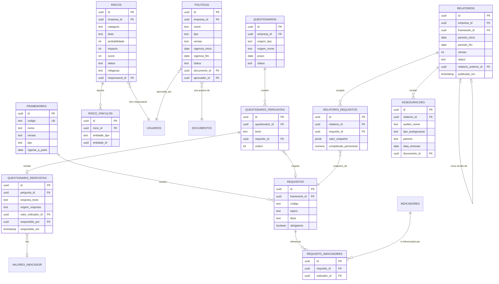

# Modelo de Dados — Pilar 2 (Compliance)

Detalha as entidades do Pilar Compliance do [PRD](PRD.md) (seção 3): frameworks
(IFRS S1/S2, CBPS, GRI), inventário de emissões, matriz de riscos, políticas,
evidências, questionários e relatórios/asseguração.

## 0. Regra de fronteira com o Pilar 1

**Este pilar não guarda dado bruto novo.** Toda medição continua vivendo em
`indicadores` / `valores_indicador` / `documentos`, definidos em
[DATA-MODEL.md](DATA-MODEL.md). O que o Pilar 2 acrescenta é **camada de
obrigação**: qual norma exige o quê, como isso se agrupa numa avaliação de risco,
numa política, numa resposta de questionário ou num relatório publicado.

Se, ao implementar, surgir a tentação de duplicar um valor aqui "para facilitar a
query", é sinal de que falta uma junção com o Pilar 1 — não de que o Compliance
deveria ter sua própria cópia do dado.

---

## 1. Princípio de design: Indicador (Pilar 1) → Requisito (Pilar 2) → Relatório

O Pilar 1 mede o mundo. O Pilar 2 traduz essa medição em **obrigação atendida**. A
peça que faz essa tradução é o **requisito**: o item atômico de uma norma (ex.: "GRI
305-1", "IFRS S2 §29(a)") — e a razão de ele existir como entidade própria, separada
de `indicadores`, é que a relação entre os dois é **N:N**: o mesmo indicador
`GEE_ESCOPO1` atende simultaneamente a um requisito da GRI, um da CBPS e um do
inventário voluntário — construído uma vez, reutilizado em várias obrigações.

O relatório, por sua vez, não recalcula nada: ele **congela** o estado de um
conjunto de requisitos num ponto no tempo (seção 5) — porque um documento entregue a
um banco ou auditor não pode mudar silenciosamente se alguém corrigir um dado depois.

```
INDICADOR (Pilar 1, mede)  →  REQUISITO (Pilar 2, exige)  →  RELATÓRIO (Pilar 2, prova, congelado)
```

---

## 2. Diagrama de entidades



*(`INDICADORES`, `VALORES_INDICADOR`, `DOCUMENTOS`, `USUARIOS` vêm do Pilar 1 —
ver [DATA-MODEL.md](DATA-MODEL.md) para seus campos completos.)*

---

## 3. Entidades em detalhe

### 3.1 `frameworks` — catálogo de normas

Um framework é uma norma versionada, não um conceito abstrato — "GRI 2021" e uma
futura "GRI 2026" são linhas diferentes, o que permite migrar de versão sem perder
histórico de qual requisito valia em qual data.

| Campo | Tipo | Nota |
|---|---|---|
| `id` | uuid, PK | |
| `codigo` | text, unique | `IFRS_S1`, `IFRS_S2`, `CBPS`, `GRI`, `GHG_PROTOCOL_INVENTARIO_PROPRIO` |
| `nome` | text | |
| `versao` | text | ex.: "GRI 2021", "IFRS S2 (2023)" |
| `tipo` | text | regulatório / voluntário |
| `vigente_a_partir` | date | necessário porque a adoção de CBPS/IFRS é faseada — um requisito pode existir na norma mas ainda não ser obrigatório para o cliente |

### 3.2 `requisitos` — o item atômico de obrigação

| Campo | Tipo | Nota |
|---|---|---|
| `id` | uuid, PK | |
| `framework_id` | uuid, FK → frameworks | |
| `codigo` | text | ex.: `305-1`, `IFRS S2 §29(a)` |
| `topico` | text | agrupador para exibição/relatório, ex.: "Emissões", "Governança climática" — evita criar uma tabela extra só para agrupamento |
| `titulo` / `descricao` | text | |
| `obrigatorio` | boolean | alguns itens de framework são de divulgação voluntária mesmo dentro de norma regulatória |

### 3.3 `requisito_indicadores` — a junção que evita duplicar dado

| Campo | Tipo | Nota |
|---|---|---|
| `id` | uuid, PK | |
| `requisito_id` | uuid, FK → requisitos | |
| `indicador_id` | uuid, FK → indicadores (Pilar 1) | |

Um requisito pode depender de vários indicadores (ex.: um requisito de "emissões
totais" soma escopo 1 + 2); um indicador pode alimentar vários requisitos de
frameworks diferentes ao mesmo tempo. Esta tabela é o motivo de o Pilar 1 já prever,
desde o modelo anterior, que essa ligação ficaria no domínio do Compliance.

### 3.4 `riscos` + `risco_vinculos` — matriz de riscos ESG

Risco não é medição ao longo do tempo (isso é indicador) — é uma avaliação
qualitativa/semiquantitativa (probabilidade × impacto) que pode se referir a
qualquer outra entidade do sistema. Por isso usa o mesmo padrão de vínculo
polimórfico já aplicado a `documento_vinculos` no Pilar 1, em vez de colunas fixas
(`unidade_id`, `fornecedor_id`, `indicador_id`) que ficariam majoritariamente nulas.

**`riscos`**

| Campo | Tipo | Nota |
|---|---|---|
| `id` | uuid, PK | |
| `empresa_id` | uuid, FK | |
| `categoria` | text | climático_físico, climático_transição, social, governança, regulatório |
| `titulo` / `descricao` | text | |
| `probabilidade` / `impacto` | int (1–5) | |
| `score` | int | calculado (`probabilidade × impacto`) — armazenado para permitir ordenação/filtro sem recálculo em toda listagem |
| `status` | text | identificado / em_mitigação / mitigado / aceito |
| `mitigacao` | text | plano de ação |
| `responsavel_id` | uuid, FK → usuarios | |

**`risco_vinculos`**

| Campo | Tipo | Nota |
|---|---|---|
| `id` | uuid, PK | |
| `risco_id` | uuid, FK → riscos | |
| `entidade_tipo` | text | `unidade` \| `fornecedor` \| `indicador` \| `requisito` |
| `entidade_id` | uuid | |

### 3.5 `politicas` — políticas internas

Uma política é metadado de gestão (versão, vigência, quem aprovou) em cima de um
arquivo que **já existe** no Pilar 1 — por isso referencia `documento_id` em vez de
guardar o PDF de novo, reaproveitando o `hash_integridade` já definido lá.

| Campo | Tipo | Nota |
|---|---|---|
| `id` | uuid, PK | |
| `empresa_id` | uuid, FK | |
| `nome` | text | |
| `tipo` | text | ambiental, anticorrupção, fornecedores, direitos_humanos |
| `versao` | text | |
| `vigencia_inicio` / `vigencia_fim` | date, `vigencia_fim` nullable | |
| `status` | text | rascunho / vigente / em_revisão / revogada |
| `documento_id` | uuid, FK → documentos (Pilar 1) | |
| `aprovador_id` | uuid, FK → usuarios | |

### 3.6 `questionarios` + perguntas + respostas — due diligence de terceiros

Modelado em três níveis (não um campo texto solto) para que cada resposta seja
rastreável até o requisito/indicador que a sustenta, e para que fique explícito se a
resposta foi **sugerida automaticamente** (a partir da base já validada) ou
**editada manualmente** — nunca expor um número de origem desconhecida a um banco ou
cliente.

**`questionarios`**

| Campo | Tipo | Nota |
|---|---|---|
| `id` | uuid, PK | |
| `empresa_id` | uuid, FK | |
| `origem_tipo` | text | cliente / banco / investidor / órgão_regulador |
| `origem_nome` | text | |
| `prazo` | date | |
| `status` | text | recebido / em_preenchimento / respondido / enviado |

**`questionario_perguntas`**

| Campo | Tipo | Nota |
|---|---|---|
| `id` | uuid, PK | |
| `questionario_id` | uuid, FK | |
| `texto` | text | |
| `requisito_id` | uuid, FK → requisitos, nullable | quando a pergunta do terceiro mapeia direto a uma obrigação já modelada |
| `ordem` | int | |

**`questionario_respostas`**

| Campo | Tipo | Nota |
|---|---|---|
| `id` | uuid, PK | |
| `pergunta_id` | uuid, FK | |
| `resposta_texto` | text | |
| `origem_resposta` | text | `sugerida_ia` \| `editada_manual` |
| `valor_indicador_id` | uuid, FK → valores_indicador, nullable | quando a resposta cita um número específico |
| `respondido_por` | uuid, FK → usuarios | |
| `respondido_em` | timestamp | |

### 3.7 `relatorios` + `relatorio_requisitos` — o congelamento

Um relatório publicado **não pode mudar** se, semanas depois, alguém corrigir um
`valor_indicador` que ele cita — o auditor e o banco receberam aquele número
naquela data. Por isso `relatorio_requisitos` guarda um **snapshot** (`jsonb`) do
estado de cada requisito no momento da publicação, em vez de só referenciar o dado
vivo. Correção de dado depois de publicado gera **nova versão do relatório**
(`relatorio_anterior_id` autorreferenciado), nunca edição in-place — mesmo princípio
de imutabilidade já usado em `auditoria_log` e `hash_integridade` no Pilar 1.

**`relatorios`**

| Campo | Tipo | Nota |
|---|---|---|
| `id` | uuid, PK | |
| `empresa_id` | uuid, FK | |
| `framework_id` | uuid, FK → frameworks | |
| `periodo_inicio` / `periodo_fim` | date | |
| `versao` | int | |
| `status` | text | rascunho / em_revisão / publicado / substituído |
| `relatorio_anterior_id` | uuid, FK → relatorios, nullable | |
| `publicado_em` | timestamp, nullable | |

**`relatorio_requisitos`**

| Campo | Tipo | Nota |
|---|---|---|
| `id` | uuid, PK | |
| `relatorio_id` | uuid, FK | |
| `requisito_id` | uuid, FK | |
| `valor_snapshot` | jsonb | indicadores, valores e evidências daquele requisito congelados no momento da publicação |
| `completude_percentual` | numeric | também congelado — não recalcula depois que o relatório é publicado |

### 3.8 `assegurancoes` — auditoria/asseguração externa

A asseguração avalia o **relatório como um todo** (ou um escopo definido dele), não
indicador por indicador — por isso referencia `relatorio_id`, não `requisito_id`.

| Campo | Tipo | Nota |
|---|---|---|
| `id` | uuid, PK | |
| `relatorio_id` | uuid, FK → relatorios | |
| `auditor_nome` / `auditor_empresa` | text | |
| `tipo_asseguracao` | text | limitada / razoável |
| `parecer` | text | aprovado / aprovado_com_ressalvas / reprovado |
| `data_emissao` | date | |
| `documento_id` | uuid, FK → documentos (Pilar 1) | parecer assinado |

---

## 4. Como o "pacote de evidências por IA" é montado

O card do PRD (seção 3.2) não é uma tabela própria — é uma **consulta computada**,
gerada sob demanda a partir do que já existe:

```
pacote(requisito) =
    requisito
    + indicadores ligados (via requisito_indicadores)
        + últimos valores_indicador de cada um (Pilar 1)
            + fontes_valor de cada valor (Pilar 1)
            + documentos vinculados via documento_vinculos (Pilar 1)
    + riscos vinculados (via risco_vinculos, entidade_tipo = requisito)
    + políticas relevantes (por tipo/categoria do requisito)
```

Isso só é **persistido e imutável** no momento em que um requisito entra num
relatório publicado — aí vira `relatorio_requisitos.valor_snapshot`. Antes disso, o
pacote é sempre a visão mais atual do dado, exatamente para refletir toda validação
ou nova evidência assim que ela entra pelo Pilar 1.

---

## 5. Em aberto / próxima decisão

- **Tolerância de completude por requisito** — quando um requisito depende de 3
  indicadores mas só 2 estão validados, o que conta como "completo"? Provavelmente
  regra configurável por `requisito` (todos obrigatórios vs. limiar percentual), a
  definir junto com o motor de completude.
- **Requisitos equivalentes entre frameworks** (ex.: um requisito de GRI e um de
  CBPS que pedem essencialmente o mesmo dado) — hoje cada um é uma linha
  independente em `requisitos`, mesmo que aponte para os mesmos `indicadores`. Pode
  valer a pena, no futuro, uma tabela `requisitos_equivalentes` para não fazer o
  usuário preencher/validar a mesma coisa duas vezes — adiado até haver casos reais
  de sobreposição para modelar certo.
- **Granularidade de `origem_resposta`** em `questionario_respostas` — hoje é
  binário (sugerida_ia / editada_manual); pode precisar de um terceiro estado
  "sugerida_ia_e_validada" se o produto quiser distinguir resposta de IA aceita sem
  edição de resposta de IA nunca revisada.
