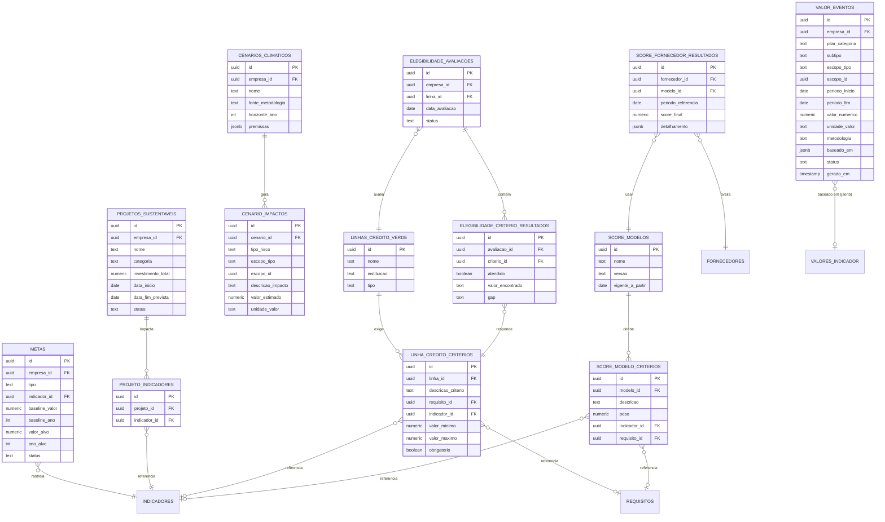

# Modelo de Dados — Pilar 3 (Valor)

Detalha as entidades do Pilar Valor do [PRD](PRD.md) (seção 4): financeiro, capital,
comercial e estratégia — a tradução de dado validado ([DATA-MODEL.md](DATA-MODEL.md))
e obrigação atendida ([DATA-MODEL-COMPLIANCE.md](DATA-MODEL-COMPLIANCE.md)) em
resposta objetiva de "quanto isso vale para a empresa".

## 0. Regra de fronteira com os Pilares 1 e 2

**Este pilar não mede nada e não define nenhuma norma.** Toda medição bruta continua
em `indicadores` / `valores_indicador` (Pilar 1); toda obrigação/norma continua em
`requisitos` / `relatorios` / `riscos` (Pilar 2). O que o Pilar 3 acrescenta é
**tradução**: pegar o que já foi validado e convertê-lo em R$, em elegibilidade de
crédito, em score comercial ou em meta estratégica.

Consequência direta desta regra: **todo registro de valor precisa ser rastreável até
o dado de origem** (`baseado_em`, seção 2). Um número de "economia gerada" que não
aponta para o `valor_indicador` que o sustenta é exatamente o tipo de afirmação vaga
("sua empresa é ESG") que o PRD (seção 4) diz que o produto existe para não fazer.

---

## 1. Princípio de design: um ledger genérico de valor + objetos de plano à parte

Os quatro sub-pilares (financeiro, capital, comercial, estratégia) respondem, no
fundo, à mesma pergunta — "quanto, para quem, em que período, baseado em quê" —
diferindo só na unidade (R$, score, %, tCO2e evitado) e no subtipo. Por isso existe
**uma única tabela-fato, `valor_eventos`**, no mesmo espírito do catálogo genérico de
`indicadores` no Pilar 1: criar uma tabela por sub-pilar geraria quatro schemas quase
idênticos e obrigaria qualquer dashboard a fazer UNION de quatro fontes para mostrar
"valor total gerado".

O que **não** entra nesse ledger são os objetos que têm vida própria e prazo — uma
**meta**, um **projeto**, um **cenário climático**, uma **linha de crédito verde**,
um **modelo de score**. Esses são planos/definições com início, fim, critérios e
versão; o valor que eles geram ao longo do tempo é que vira uma linha em
`valor_eventos` apontando de volta para eles (`escopo_tipo = meta/projeto/cenario/
linha_credito`). É o mesmo padrão de "definição vs. medição" já usado em
`indicadores` → `valores_indicador` (Pilar 1) e `frameworks/requisitos` →
`relatorio_requisitos` (Pilar 2).

---

## 2. Diagrama de entidades



*(`INDICADORES`, `VALORES_INDICADOR`, `FORNECEDORES` vêm do Pilar 1 —
[DATA-MODEL.md](DATA-MODEL.md); `REQUISITOS` vêm do Pilar 2 —
[DATA-MODEL-COMPLIANCE.md](DATA-MODEL-COMPLIANCE.md).)*

---

## 3. Entidades em detalhe

### 3.1 `valor_eventos` — o ledger genérico (a tabela-fato deste pilar)

Cobre sozinho todo o **Financeiro** (economia de energia, redução de desperdício,
redução de emissões, eficiência operacional) e a maior parte do **Capital**
(indicadores para bancos/investidores, perfil de risco) e do **Comercial**
(evolução de score, requisito de cliente atendido) — qualquer coisa que seja "um
número de valor num período", sem estado próprio de plano.

| Campo | Tipo | Nota |
|---|---|---|
| `id` | uuid, PK | |
| `empresa_id` | uuid, FK | |
| `pilar_categoria` | text | `financeiro` \| `capital` \| `comercial` \| `estrategia` |
| `subtipo` | text | `economia_energia`, `reducao_desperdicio`, `reducao_emissao`, `eficiencia_operacional`, `perfil_risco_credito`, `score_fornecedor_variacao`, `requisito_cliente_atendido`, `roi_projeto`, `custo_transicao`, `impacto_cenario` |
| `escopo_tipo` | text | `unidade` \| `fornecedor` \| `empresa` \| `projeto` \| `cenario` \| `linha_credito` |
| `escopo_id` | uuid | aponta para a entidade correspondente ao `escopo_tipo` |
| `periodo_inicio` / `periodo_fim` | date | |
| `valor_numerico` | numeric | |
| `unidade_valor` | text | `BRL`, `percentual`, `score`, `tCO2e_evitado` |
| `metodologia` | text | como o número foi calculado (ex.: "baseline − real, convertido pela tarifa média de energia do período") |
| `baseado_em` | jsonb | ids de `valores_indicador` / `requisitos` / `relatorios` que sustentam o cálculo — obrigatório, não decorativo (seção 0) |
| `status` | text | `calculado` / `validado` / `publicado` |
| `gerado_em` | timestamp | |

**Exemplo de linha — "economia de energia" do Financeiro:**

```
pilar_categoria:  financeiro
subtipo:          economia_energia
escopo:           unidade "Usina Norte"
período:          2026-01 a 2026-06
valor_numerico:   184.500
unidade_valor:    BRL
metodologia:      baseline 2024 (kWh/ton) − consumo real 2026 (kWh/ton),
                  convertido pela tarifa média contratada do período
baseado_em:       ["valor_indicador:8f3a...", "valor_indicador:9c1e..."]
status:           validado
```

### 3.2 `metas` — metas de descarbonização e afins (Estratégia)

Uma meta rastreia **um** indicador do Pilar 1 contra um alvo e um prazo — é o que dá
ao Pilar 3 algo contra o que medir progresso, em vez de só reportar o valor bruto do
período.

| Campo | Tipo | Nota |
|---|---|---|
| `id` | uuid, PK | |
| `empresa_id` | uuid, FK | |
| `tipo` | text | descarbonização, eficiência_energética, redução_resíduo, redução_hídrica |
| `indicador_id` | uuid, FK → indicadores (Pilar 1) | |
| `baseline_valor` / `baseline_ano` | numeric / int | ponto de partida |
| `valor_alvo` / `ano_alvo` | numeric / int | |
| `status` | text | em_andamento / atingida / não_atingida / revisada |

### 3.3 `projetos_sustentaveis` + `projeto_indicadores` — ROI de projetos (Estratégia)

Um projeto tem investimento e cronograma próprios; seus retornos realizados, período
a período, entram como `valor_eventos` (`escopo_tipo = projeto`, `subtipo =
roi_projeto`) — o ROI é `soma(valor_eventos.valor_numerico) / investimento_total`,
calculado, não armazenado.

**`projetos_sustentaveis`**

| Campo | Tipo | Nota |
|---|---|---|
| `id` | uuid, PK | |
| `empresa_id` | uuid, FK | |
| `nome` | text | |
| `categoria` | text | energia_renovável, eficiência_hídrica, redução_resíduo, logística_verde |
| `investimento_total` | numeric | |
| `data_inicio` / `data_fim_prevista` | date | |
| `status` | text | planejado / em_execução / concluído / cancelado |

**`projeto_indicadores`** (junção — quais indicadores o projeto deve mover)

| Campo | Tipo | Nota |
|---|---|---|
| `id` | uuid, PK | |
| `projeto_id` | uuid, FK | |
| `indicador_id` | uuid, FK → indicadores | |

### 3.4 `cenarios_climaticos` + `cenario_impactos` — cenários (Estratégia)

Um cenário é a definição das premissas (ex.: "1,5 °C — NGFS Net Zero 2050"); os
impactos calculados sob esse cenário — por unidade, fornecedor ou empresa — ficam em
linhas separadas, porque um único cenário costuma gerar vários impactos (físico e de
transição) em escopos diferentes.

**`cenarios_climaticos`**

| Campo | Tipo | Nota |
|---|---|---|
| `id` | uuid, PK | |
| `empresa_id` | uuid, FK | |
| `nome` | text | |
| `fonte_metodologia` | text | ex.: NGFS, IPCC |
| `horizonte_ano` | int | |
| `premissas` | jsonb | parâmetros do cenário (preço de carbono assumido, trajetória de temperatura...) |

**`cenario_impactos`**

| Campo | Tipo | Nota |
|---|---|---|
| `id` | uuid, PK | |
| `cenario_id` | uuid, FK | |
| `tipo_risco` | text | físico / transição |
| `escopo_tipo` / `escopo_id` | text / uuid | unidade, fornecedor ou empresa afetada |
| `descricao_impacto` | text | |
| `valor_estimado` | numeric | |
| `unidade_valor` | text | BRL, percentual |

### 3.5 `linhas_credito_verde` + critérios + avaliações — Capital

Elegibilidade não é um score único — é **aprovar/reprovar por critério**, para o
produto mostrar não só "você está elegível" mas "falta X e Y". Por isso três tabelas:
o catálogo da linha, o critério que ela exige, e o resultado da avaliação
critério-a-critério para uma empresa específica.

**`linhas_credito_verde`** (catálogo)

| Campo | Tipo | Nota |
|---|---|---|
| `id` | uuid, PK | |
| `nome` | text | |
| `instituicao` | text | banco/agência de fomento |
| `tipo` | text | crédito_rural_sustentável, green_bond, sustainability_linked_loan |

**`linha_credito_criterios`**

| Campo | Tipo | Nota |
|---|---|---|
| `id` | uuid, PK | |
| `linha_id` | uuid, FK | |
| `descricao_criterio` | text | |
| `requisito_id` | uuid, FK → requisitos (Pilar 2), nullable | quando o critério é "ter tal divulgação pronta" |
| `indicador_id` | uuid, FK → indicadores (Pilar 1), nullable | quando o critério é numérico (ex.: intensidade de emissão abaixo de X) |
| `valor_minimo` / `valor_maximo` | numeric, nullable | faixa aceitável, quando aplicável |
| `obrigatorio` | boolean | |

**`elegibilidade_avaliacoes`**

| Campo | Tipo | Nota |
|---|---|---|
| `id` | uuid, PK | |
| `empresa_id` | uuid, FK | |
| `linha_id` | uuid, FK | |
| `data_avaliacao` | date | |
| `status` | text | elegível / elegível_parcial / não_elegível |

**`elegibilidade_criterio_resultados`**

| Campo | Tipo | Nota |
|---|---|---|
| `id` | uuid, PK | |
| `avaliacao_id` | uuid, FK | |
| `criterio_id` | uuid, FK | |
| `atendido` | boolean | |
| `valor_encontrado` | text | o que o sistema encontrou para aquele critério |
| `gap` | text, nullable | o que falta, quando `atendido = false` — é isso que vira o plano de ação de "preparação para financiamento sustentável" |

### 3.6 `score_modelos` + critérios + resultados — Score ESG de fornecedores (Comercial)

Um score de fornecedor precisa de **metodologia versionada**: se os pesos/critérios
mudarem no futuro, um score calculado em 2025 sob o modelo v1 não pode silenciosamente
passar a significar outra coisa — mesmo racional já usado para versionar `relatorios`
no Pilar 2.

**`score_modelos`**

| Campo | Tipo | Nota |
|---|---|---|
| `id` | uuid, PK | |
| `nome` | text | |
| `versao` | text | |
| `vigente_a_partir` | date | |

**`score_modelo_criterios`**

| Campo | Tipo | Nota |
|---|---|---|
| `id` | uuid, PK | |
| `modelo_id` | uuid, FK | |
| `descricao` | text | |
| `peso` | numeric | |
| `indicador_id` | uuid, FK, nullable | |
| `requisito_id` | uuid, FK, nullable | |

**`score_fornecedor_resultados`**

| Campo | Tipo | Nota |
|---|---|---|
| `id` | uuid, PK | |
| `fornecedor_id` | uuid, FK → fornecedores (Pilar 1) | |
| `modelo_id` | uuid, FK | |
| `periodo_referencia` | date | |
| `score_final` | numeric | |
| `detalhamento` | jsonb | score por critério, para explicar o número ao invés de só exibi-lo |

A variação do score ao longo do tempo (subiu/caiu, e quanto isso "vale"
comercialmente) é o que gera uma linha em `valor_eventos`
(`subtipo = score_fornecedor_variacao`), fechando o mesmo padrão definição-vs-medição
do resto do modelo.

### 3.7 Requisitos de cliente e exportação — sem tabela própria

"Atender requisito de cliente" e "preparação para exportação" **não** ganham
entidade nova: são, na prática, o mesmo objeto que `questionarios` já modela no
Pilar 2 (uma exigência externa, com prazo e resposta). O Pilar 3 só lê esse
resultado e o converte em valor comercial via `valor_eventos`
(`subtipo = requisito_cliente_atendido`, `baseado_em` apontando para o
`questionario_id`/`questionario_resposta_id` relevante). Criar uma tabela paralela
aqui repetiria exatamente o erro que a seção 0 pede para evitar.

---

## 4. Como isso responde "quanto o ESG está gerando ou economizando" (seção 4 do PRD)

| Sub-pilar do PRD | De onde vem no modelo |
|---|---|
| Financeiro (economia de energia, resíduo, emissão, eficiência) | `valor_eventos` (`pilar_categoria = financeiro`) |
| Capital — elegibilidade para linhas verdes | `elegibilidade_avaliacoes` + `elegibilidade_criterio_resultados` |
| Capital — indicadores p/ bancos e perfil de risco | `valor_eventos` (`subtipo = perfil_risco_credito`), `baseado_em` apontando para `riscos` (Pilar 2) |
| Comercial — score ESG de fornecedores | `score_fornecedor_resultados` (+ variação em `valor_eventos`) |
| Comercial — requisito de cliente / exportação | `questionarios` (Pilar 2) traduzido via `valor_eventos` |
| Estratégia — metas de descarbonização | `metas` |
| Estratégia — cenários climáticos | `cenarios_climaticos` + `cenario_impactos` |
| Estratégia — custo de transição | `valor_eventos` (`subtipo = custo_transicao`, `baseado_em` apontando para `cenario_impactos`) |
| Estratégia — ROI de projetos | `projetos_sustentaveis` + `valor_eventos` (`subtipo = roi_projeto`) |

---

## 5. Em aberto / próxima decisão

- **Moeda e correção temporal** — `valor_eventos.valor_numerico` em BRL precisa de
  regra de atualização (inflação/câmbio) se for comparar períodos distantes; ainda
  não definido se isso é campo (`valor_corrigido`) ou cálculo em tempo de leitura.
- **Quem valida um `valor_evento` antes de virar `status = publicado`** — o Pilar 1
  já tem esse papel claro (`responsavel_id` em `valores_indicador`); aqui ainda não
  há campo equivalente. Provável adicionar `validado_por` (FK → usuarios) seguindo o
  mesmo padrão, a confirmar quando o fluxo de aprovação for desenhado.
- **Cenários climáticos e o inventário de emissões do Pilar 2** — `cenario_impactos`
  hoje não referencia `requisitos`/`relatorios` diretamente; se um relatório
  regulatório (ex.: IFRS S2, que exige análise de cenário) precisar citar um
  `cenario_impacto` específico como evidência, falta uma junção — adiado até esse
  requisito aparecer no Pilar 2 em concreto.
