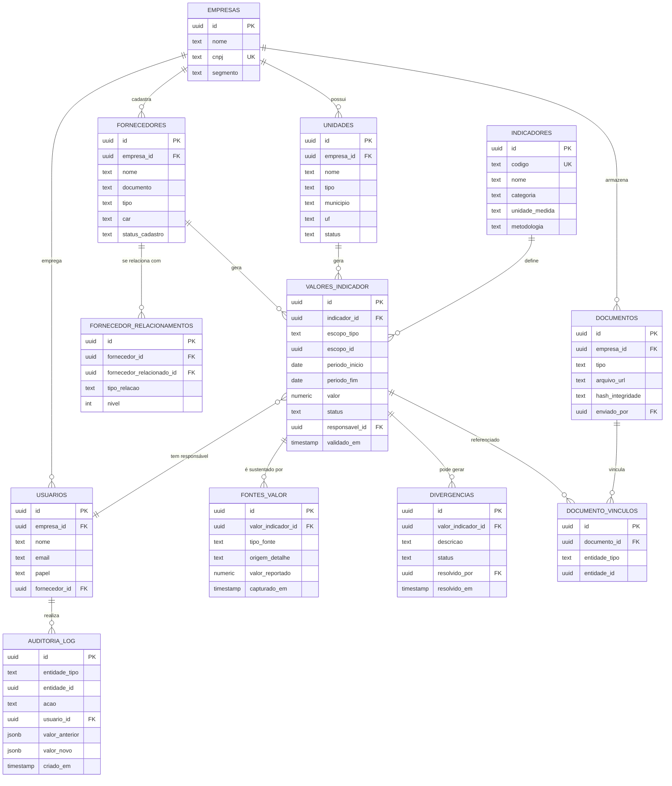

# Modelo de Dados — Pilar 1 (Dados)

Detalha as entidades que sustentam o Pilar Dados do [PRD](PRD.md) (seção 2): coleta,
validação, cruzamento e trilha de auditoria das sete fontes (energia/água/resíduos,
emissões, fornecedores, indicadores sociais, documentos/evidências, unidades/filiais,
cadeia de valor).

Este modelo é a fundação de que os outros dois pilares dependem:

- **Compliance** (Pilar 2) não cria dado novo — ele consome `indicadores`,
  `valores_indicador` e `documentos` para montar o "pacote de evidências" por
  indicador descrito no PRD (seção 3.2).
- **Valor** (Pilar 3) não recalcula nada do zero — ele lê os mesmos `valores_indicador`
  já validados para gerar as respostas financeiras/de capital/comerciais/estratégicas
  (seção 4 do PRD).

Nomes de tabela em `snake_case` (convenção Postgres/Drizzle já usada nos demais
projetos — ver [[dev_md_methodology]]).

---

## 1. Princípio de design: um "fato" central, tudo mais orbita em volta dele

A decisão estrutural mais importante deste modelo é **separar o valor consolidado de
um indicador (`valores_indicador`) das fontes brutas que o sustentam (`fontes_valor`)**.

Sem essa separação, "cruzar dados" (exigência central do PRD) não existe — o sistema
só teria um número final, sem como saber se ele bate com a fatura, com o ERP e com o
fornecedor ao mesmo tempo. Com a separação:

- `valores_indicador` guarda o número que a empresa vê e usa (o "fato").
- `fontes_valor` guarda cada origem que contribuiu ou tentou contribuir para esse
  número — permitindo comparar N fontes entre si.
- `divergencias` nasce automaticamente quando duas fontes do mesmo `valor_indicador`
  não batem, em vez de o sistema aceitar cegamente a última que chegou.

Essa mesma lógica de "fato + fontes + evidências + log" se repete para toda entidade
sensível (fornecedor, documento), o que é o que dá a trilha de auditoria fim-a-fim.

---

## 2. Diagrama de entidades



---

## 3. Entidades em detalhe

### 3.1 `empresas` — tenant

Toda tabela raiz carrega `empresa_id`. Nenhum dado cruza entre empresas clientes —
isolamento multi-tenant é regra, não opção de query.

| Campo | Tipo | Nota |
|---|---|---|
| `id` | uuid, PK | |
| `nome` | text | |
| `cnpj` | text, unique | |
| `segmento` | text | ex.: cana-de-açúcar, soja, café — texto livre/enum extensível, não trava a arquitetura a um único commodity |

### 3.2 `unidades` — unidades/filiais

Cobre a fonte "dados de unidades/filiais" do PRD. Uma usina com múltiplas plantas
industriais tem uma linha por planta, não uma por empresa.

| Campo | Tipo | Nota |
|---|---|---|
| `id` | uuid, PK | |
| `empresa_id` | uuid, FK → empresas | |
| `nome` | text | |
| `tipo` | text | usina, planta_industrial, fazenda, armazém, escritório |
| `cnpj` | text, nullable | filial pode ter CNPJ próprio |
| `municipio` / `uf` | text | necessário para cruzar com bases públicas (CAR, embargos, desmatamento) |
| `status` | text | ativa / inativa |

### 3.3 `fornecedores` + `fornecedor_relacionamentos` — cadeia de fornecedores e de valor

Cobre "fornecedores" e "informações da cadeia de valor". A cadeia (fornecedor do
fornecedor) é modelada como relação **auto-referenciada de profundidade variável**,
em vez de colunas fixas (`fornecedor_nivel_2`, `fornecedor_nivel_3`...) — necessário
porque a profundidade real da cadeia varia por operação e não pode ficar travada no
schema.

**`fornecedores`**

| Campo | Tipo | Nota |
|---|---|---|
| `id` | uuid, PK | |
| `empresa_id` | uuid, FK | empresa compradora dona do cadastro |
| `nome` / `documento` | text | CNPJ ou CPF |
| `tipo` | text | produtor_rural, cooperativa, transportadora, prestador_servico, indústria |
| `car` | text, nullable | Cadastro Ambiental Rural, quando aplicável (produtor rural) |
| `status_cadastro` | text | pendente / ativo / bloqueado |

**`fornecedor_relacionamentos`**

| Campo | Tipo | Nota |
|---|---|---|
| `id` | uuid, PK | |
| `fornecedor_id` | uuid, FK → fornecedores | |
| `fornecedor_relacionado_id` | uuid, FK → fornecedores | o "fornecedor do fornecedor" |
| `tipo_relacao` | text | fornece_para, subcontratado_de, transporta_para |
| `nivel` | int | profundidade na cadeia (1 = direto, 2+ = indireto) |

> Nota de produto: reuso de cadastro de fornecedor entre compradores concorrentes
> (mesmo fornecedor cadastrado por dois clientes Ominia) foi deixado como decisão
> adiada no PRD original — este modelo assume cadastro isolado por `empresa_id` até
> essa decisão ser tomada.

### 3.4 `indicadores` — catálogo genérico

Este é o ponto de maior alavancagem do modelo: em vez de uma tabela por categoria
(energia, água, resíduos, emissões, social...), existe **um catálogo genérico de
indicadores**, e cada categoria é só um valor de campo. Isso é o que permite ao PRD
(seção 6.2) tratar novo requisito regulatório como configuração — cadastrar um
indicador novo — em vez de migration/retrabalho de arquitetura.

| Campo | Tipo | Nota |
|---|---|---|
| `id` | uuid, PK | |
| `codigo` | text, unique | ex.: `GEE_ESCOPO1`, `ENERGIA_CONSUMO`, `RESIDUO_DESTINACAO` |
| `nome` | text | |
| `categoria` | text | energia, água, resíduos, emissões, social, governança |
| `unidade_medida` | text | tCO2e, kWh, m³, ton, % |
| `metodologia` | text, nullable | referência ao método de cálculo (ex.: GHG Protocol, escopo 1/2/3) |

A ligação entre indicador e framework regulatório (IFRS S1/S2, CBPS, GRI) fica numa
tabela de junção `indicador_frameworks` no domínio do Pilar 2 — este documento só
define o indicador em si; o mapeamento para exigência regulatória é responsabilidade
do modelo de Compliance.

### 3.5 `valores_indicador` — a tabela-fato

O número que a empresa efetivamente vê e usa. `escopo_tipo` + `escopo_id` são
polimórficos de propósito: o mesmo indicador (ex. emissões) pode ser medido no nível
da unidade (planta) **ou** do fornecedor (ex. emissão de transporte de um
fornecedor específico) sem duplicar o schema por tipo de escopo.

| Campo | Tipo | Nota |
|---|---|---|
| `id` | uuid, PK | |
| `indicador_id` | uuid, FK → indicadores | |
| `escopo_tipo` | text | `unidade` \| `fornecedor` \| `empresa` |
| `escopo_id` | uuid | aponta para `unidades.id`, `fornecedores.id` ou `empresas.id` conforme `escopo_tipo` |
| `periodo_inicio` / `periodo_fim` | date | competência (mês, trimestre ou ano) |
| `valor` | numeric | valor consolidado |
| `status` | text | pendente / validado / divergente / rejeitado |
| `responsavel_id` | uuid, FK → usuarios | quem responde por aquele número — o campo "Responsável" do card de compliance |
| `validado_em` | timestamp, nullable | alimenta o campo "Última validação" do card de compliance |

### 3.6 `fontes_valor` — origem de cada valor (o que permite o cruzamento)

Uma ou mais linhas por `valor_indicador`. É a peça que faz o "não depender de
planilhas" ser verdade: o valor final não é digitado, é a consolidação (ou o
conflito) de fontes reais.

| Campo | Tipo | Nota |
|---|---|---|
| `id` | uuid, PK | |
| `valor_indicador_id` | uuid, FK | |
| `tipo_fonte` | text | erp, fornecedor, documento_fiscal, medição_manual, integração_externa, planilha_importada |
| `origem_detalhe` | text | nome do sistema, remetente, nome do arquivo |
| `valor_reportado` | numeric | valor conforme aquela fonte específica — pode divergir do valor consolidado |
| `capturado_em` | timestamp | |

### 3.7 `divergencias` — o que dá visibilidade ao cruzamento

Criada automaticamente quando duas ou mais `fontes_valor` do mesmo
`valor_indicador` não convergem dentro de uma tolerância configurável. Fica aberta
até validação humana — nunca resolvida silenciosamente pelo sistema.

| Campo | Tipo | Nota |
|---|---|---|
| `id` | uuid, PK | |
| `valor_indicador_id` | uuid, FK | |
| `descricao` | text | ex.: "energia ERP diverge 12% da fatura" |
| `status` | text | aberta / em_análise / resolvida |
| `resolvido_por` | uuid, FK → usuarios, nullable | |
| `resolvido_em` | timestamp, nullable | |

### 3.8 `documentos` + `documento_vinculos` — evidências

Cobre "documentos e evidências". `hash_integridade` garante que, depois que um
documento sustentou uma validação, ele não pode ser silenciosamente trocado sem
quebrar o hash — parte do que torna a trilha de auditoria defensável perante um
auditor externo.

A ligação a outras entidades é **polimórfica** (`documento_vinculos`) porque uma
única evidência (ex.: uma nota fiscal de energia) frequentemente sustenta mais de um
`valor_indicador` ao mesmo tempo (energia e emissão do mesmo mês), e um documento
também pode se vincular direto a um fornecedor (certificado) sem estar ligado a
nenhum valor específico.

**`documentos`**

| Campo | Tipo | Nota |
|---|---|---|
| `id` | uuid, PK | |
| `empresa_id` | uuid, FK | |
| `tipo` | text | laudo, certificado, nota_fiscal, contrato, foto, questionário_respondido |
| `arquivo_url` | text | |
| `hash_integridade` | text | sha256 do arquivo no momento do upload |
| `enviado_por` | uuid, FK → usuarios | |

**`documento_vinculos`**

| Campo | Tipo | Nota |
|---|---|---|
| `id` | uuid, PK | |
| `documento_id` | uuid, FK → documentos | |
| `entidade_tipo` | text | `valor_indicador` \| `fornecedor` \| `unidade` |
| `entidade_id` | uuid | |

### 3.9 `usuarios`

Um único modelo de usuário cobre tanto o time interno da empresa cliente quanto o
Supplier Portal (gratuito para o fornecedor, por decisão de produto já registrada em
memória). `fornecedor_id` fica nulo para usuários internos e preenchido para
usuários do portal do fornecedor.

| Campo | Tipo | Nota |
|---|---|---|
| `id` | uuid, PK | |
| `empresa_id` | uuid, FK, nullable | nulo para usuário puro de fornecedor sem vínculo direto de empresa |
| `nome` / `email` | text | |
| `papel` | text | admin, operações, compliance, fornecedor |
| `fornecedor_id` | uuid, FK, nullable | preenchido quando `papel = fornecedor` |

### 3.10 `auditoria_log` — trilha de auditoria transversal

Diferente de `validado_em` (que só mostra o estado atual), este log é
**append-only** e captura toda mudança relevante em qualquer entidade sensível —
é o que sustenta a frase do PRD "trilha de auditoria" perante um auditor ou banco.

| Campo | Tipo | Nota |
|---|---|---|
| `id` | uuid, PK | |
| `entidade_tipo` | text | valor_indicador, fornecedor, documento, divergência... |
| `entidade_id` | uuid | |
| `acao` | text | criado, alterado, validado, rejeitado, arquivado |
| `usuario_id` | uuid, FK → usuarios | |
| `valor_anterior` / `valor_novo` | jsonb | snapshot antes/depois, quando aplicável |
| `criado_em` | timestamp | |

---

## 4. Como isso alimenta o card de Compliance (Pilar 2)

O exemplo de card do PRD —

```
Indicador:          Emissões de GEE
Status:             92% completo
Evidências:         14 documentos
Fonte:              ERP + fornecedor + documento fiscal
Responsável:        Operações
Última validação:   12/08/2026
```

— é inteiramente derivado deste modelo, sem dado novo:

- **Indicador** → `indicadores.nome`
- **Status (% completo)** → função de `valores_indicador.status` + cobertura de
  evidências esperadas vs. vinculadas em `documento_vinculos`
- **Evidências** → `count(documento_vinculos)` para aquele `valor_indicador`
- **Fonte** → `distinct(fontes_valor.tipo_fonte)` daquele `valor_indicador`
- **Responsável** → `valores_indicador.responsavel_id` → `usuarios.nome`
- **Última validação** → `valores_indicador.validado_em`

Se o Pilar 2 no futuro precisar de campo que não existe aqui, é sinal de que falta
algo neste modelo — não de que o Compliance deveria guardar seu próprio dado
paralelo.

---

## 5. Em aberto / próxima decisão

- Tolerância de divergência por indicador (ex.: 5% para energia, 0% para dado
  fiscal) — provavelmente um campo em `indicadores` (`tolerancia_divergencia`), a
  confirmar quando o motor de cruzamento for especificado.
- Consentimento do fornecedor para reuso de cadastro entre empresas compradoras
  (decisão adiada no PRD) — impacta diretamente se `fornecedores` continua 1:1 com
  `empresa_id` ou passa a ter um cadastro global com permissão por comprador.
- Retenção/versionamento de `documentos` quando um arquivo é substituído (nova
  versão do mesmo laudo) — hoje o modelo trata substituição como novo registro; se
  for necessário histórico de versões do mesmo documento lógico, precisa de
  `documento_id_anterior` ou tabela de versões.
