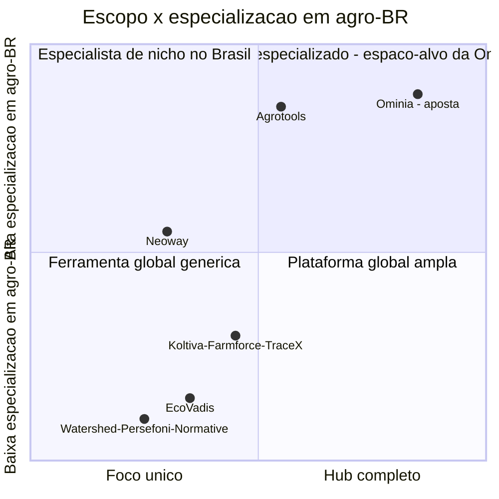

# Ominia — Tese de Negócio, Mercado e Modelo Comercial

Ebook interno de produto/negócio · Versão 0.1 · 2026-08-22

> Este documento complementa o [PRD](PRD.md) e os três modelos de dados
> ([Dados](DATA-MODEL.md), [Compliance](DATA-MODEL-COMPLIANCE.md),
> [Valor](DATA-MODEL-VALOR.md)) com a tese comercial: por que este negócio existe, por
> que agora, para quem, quanto cobrar e por quê, contra quem competimos, e o que custa
> construir. Números de mercado citados aqui vêm de pesquisa dedicada (fontes ao final,
> capítulo 14) — onde a fonte é fraca, ambígua ou ausente, isso está dito
> explicitamente, em vez de apresentado como certeza.

---

## 1. Sumário executivo

A Ominia vende **confiança sobre dado ESG de agroindústria, traduzida em decisão de
negócio**. A tese em uma frase: enquanto a concorrência disputa "quem faz o melhor
relatório", a Ominia disputa **"quem prova para o banco, o cliente e o auditor que o
número é real"** — e depois mostra, em reais, quanto esse número vale.

Três fatos de mercado sustentam a aposta, e todos os três vieram da pesquisa (não de
suposição):

1. **O gatilho regulatório doméstico é mais fraco do que parecia em agosto de 2026.**
   A CVM tornou a divulgação de sustentabilidade (CBPS/IFRS S1-S2) **voluntária de
   novo** em maio de 2026, revertendo a obrigatoriedade que estava programada para
   2026 (capítulo 3.4). Isso muda a venda de "você é obrigado" para "você sai na
   frente e prova isso ao mercado" — uma venda mais difícil, mas com margem melhor e
   menos concorrência de "checkbox compliance".
2. **A pressão real, hoje, é comercial e de exportação — não doméstica.** O
   Regulamento Europeu de Desmatamento (EUDR) entra em vigor para operadores
   grandes/médios em **30 de dezembro de 2026**, e cobre soja, carne, café, cacau,
   madeira, dendê e borracha (não cana-de-açúcar diretamente). Novas regras de
   crédito rural também estão **aumentando a exigência de inteligência territorial
   dentro dos bancos** — um canal B2B2B real e pouco explorado (capítulo 3.5, 8.2).
3. **O mercado de software ESG é pequeno perto do hype, mas cresce rápido — e o Brasil
   não tem número próprio confiável.** O segmento global de "ESG reporting software"
   vale ~US$1,3 bi (2023) crescendo para ~US$5,6 bi até 2029 (Verdantix); não existe
   estimativa em dólares especificamente para o Brasil que resista a uma checagem de
   fonte primária (capítulo 3.2) — isso é dito às claras, não maquiado com um número
   emprestado de outro mercado.

O ICP inicial (usinas de cana-de-açúcar e agroindústrias de porte médio-grande) e o
modelo de precificação por empresa — não por fornecedor cadastrado — são o núcleo do
capítulo 6, que é o capítulo mais importante deste documento por pedido explícito.

---

## 2. A tese de negócio

### 2.1 O problema em uma frase

Agroindústria brasileira de porte médio-grande tem dado ESG disperso, sem trilha de
auditoria, e por isso não consegue: (a) responder rápido a due diligence de cliente ou
banco, (b) provar redução de custo/risco que já aconteceu na operação, e (c) acessar
capital ou mercado mais barato/melhor por causa disso. O dado existe — em ERP, em
e-mail, em planilha, em nota fiscal — mas não existe **de um jeito que sustente uma
afirmação perante terceiro**.

### 2.2 Por que agora

Não é "porque ESG está na moda". É porque três relógios estão correndo ao mesmo tempo,
e nenhum deles espera a empresa se organizar:

- **Relógio comercial**: EUDR (dez/2026) e exigências crescentes de grandes
  compradores/tradings sobre rastreabilidade e evidência — já começou a bater na
  porta de exportadores de soja, carne, café.
- **Relógio de capital**: bancos estão sendo obrigados a ter mais inteligência
  territorial/socioambiental para conceder crédito rural — o que empurra a exigência
  de evidência para dentro da relação banco-produtor, não só para relatório voluntário.
- **Relógio de custo**: energia, resíduo, água e eficiência operacional já geram
  economia hoje, mas a empresa não consegue apontar o número — está deixando prova de
  valor em cima da mesa.

### 2.3 Por que agroindústria, por que Brasil

O agronegócio é **25,13% do PIB brasileiro em 2025** (R$ 3,20 trilhões, alta de 12,2%
no ano) e as exportações do setor bateram recorde de **US$ 169,2 bilhões em 2025**
(48,5% de tudo que o Brasil exporta), com superávit setorial de US$ 149 bilhões
(CEPEA/CNA; Ministério da Agricultura, 2026) — ver capítulo 3.1 para a tabela completa.
Não existe outro setor no Brasil onde "prova de ESG" tenha, ao mesmo tempo, tanto peso
econômico e tanta bagunça de dado. Isso é oportunidade, não coincidência de nicho.

**Nota:** o PIB do agro não cresce em linha reta — o próprio CEPEA registrou recuo de
~2% no 1º trimestre de 2026 após o forte 2025. Trate crescimento do setor como
tendência de médio prazo, não como garantia trimestre a trimestre.

### 2.4 A aposta central: Dados → Compliance → Valor como motor comercial

O motivo de construir os três pilares como um hub, e não como três produtos, não é só
arquitetural (já justificado nos modelos de dados) — é **comercial**: o Pilar Dados
vende barato e rápido (dor operacional óbvia, ciclo de venda curto), o Pilar
Compliance vende por medo/urgência regulatória-comercial (ciclo médio), e o Pilar
Valor vende caro e defende o preço da renovação (o CFO renova pelo número que o
sistema já provou gerar). Land-and-expand entre os três pilares é a estratégia de
receita, não um efeito colateral do roadmap (ver capítulo 8.4).

---

## 3. Oportunidade de mercado no Brasil

### 3.1 Tamanho do setor-alvo (agroindústria brasileira)

| Métrica | Valor | Fonte |
|---|---|---|
| PIB do agronegócio (2025) | R$ 3,20 trilhões (25,13% do PIB nacional) | CEPEA/USP + CNA, 2026 |
| Crescimento do PIB do agro em 2025 | +12,2% vs. 2024 | CEPEA/CNA |
| Recuo do PIB do agro no 1º tri/2026 | −2% vs. trimestre anterior | CEPEA |
| Exportações do agronegócio (2025) | US$ 169,2 bilhões (recorde; 48,5% das exportações totais do Brasil) | Ministério da Agricultura / Agência Gov, jan/2026 |
| Superávit comercial do agro (2025) | US$ 149,07 bilhões | idem |
| Exportação de soja (2025) | US$ 43,5 bilhões (108,2 Mt, volume recorde) | idem |
| Exportação de carne/boi (2025) | US$ 31,8 bilhões (10,4 Mt; boi in natura sozinho US$ 16,6 bi, +21,4%) | idem |
| Exportação de café (2025) | US$ 14,9 bilhões (+31,1%, primeira vez acima desse patamar) | idem |
| Principais compradores (2025) | China US$ 55,3 bi (32,7%) · UE US$ 25,2 bi (14,9%) · EUA US$ 11,4 bi (6,7%) | idem |
| Empresas agroindustriais ativas no Brasil | ~3.480–4.520 (faixa entre duas bases distintas) | Econodata; Mapa Industrial |
| Usinas de cana-de-açúcar no Brasil | ~260 unidades em operação na safra 2024/25 (dado operacional mais confiável); mais de 400 no total instalado, conforme a base | UNICA (boletins de safra); imprensa setorial |

**Nota sobre precisão:** não existe uma única fonte oficial que dê "o número" de
usinas ou de empresas agroindustriais — a contagem muda conforme a definição
(instalada vs. em operação na safra vs. afiliada a uma entidade setorial). Use faixas,
não um número único, em qualquer material externo (investidor, banco, imprensa) até
validar contra o boletim de safra mais recente da UNICA.

**Exportação de açúcar e etanol especificamente:** não foi encontrada, nesta
pesquisa, uma quebra em dólares só para açúcar/etanol dentro do total de US$ 169,2
bilhões — item para uma busca dedicada antes de uma apresentação a investidor focada
no ICP de usinas.

### 3.2 O mercado de software ESG — tamanho e uma lacuna honesta

| Segmento | Tamanho | Projeção | Fonte |
|---|---|---|---|
| ESG reporting software (global) | US$ 1,3 bi (2023) | US$ 5,6 bi até 2029 (~26% CAGR) | Verdantix |
| Supply chain sustainability software (global) | US$ 1,7 bi (2023) | US$ 7,7 bi até 2029 (~29% CAGR) | Verdantix |
| Carbon management software (global) | US$ 744 mi (2025) | US$ 1,8 bi até 2031 (~15% CAGR) | Verdantix |
| ESG software, definição ampla (outra metodologia) | US$ 1,24 bi (2025) | US$ 5,19 bi até 2033 (~20% CAGR) | Grand View Research |
| "Sustainability software", categoria ainda mais ampla | US$ 4,4 bi (2025) | US$ 11,9 bi até 2031 (~18% CAGR) | Mordor Intelligence |

Essas cinco linhas **não medem a mesma coisa** — a diferença de quase 4x entre a menor
e a maior é a diferença entre "só relatório ESG" e "qualquer software que toque
sustentabilidade, incluindo EHS e consultoria". Para a Ominia, os números da Verdantix
(reporting + supply chain) são os mais próximos do escopo real do produto.

> **O que não existe:** uma estimativa em dólares/reais especificamente para o
> mercado brasileiro ou latino-americano de software ESG que resista a checagem de
> fonte primária. Um número de "6% de participação da América Latina" circula em
> buscadores, mas a fonte citada (Grand View Research) não confirma isso num acesso
> direto ao relatório. **Não usar esse número em material externo.** Trate o TAM
> brasileiro como derivado (capítulo 3.3), não como um dado publicado.

### 3.3 TAM / SAM / SOM — qualitativo, com metodologia às claras

Como não existe um número de mercado brasileiro pronto, o caminho honesto é construir
de baixo para cima, a partir do número de empresas (seção 3.1) e da faixa de preço
que a Ominia pretende praticar (capítulo 6) — não de um relatório de terceiro.

| Camada | Definição | Cálculo ilustrativo | Resultado (faixa) |
|---|---|---|---|
| **TAM** (mercado total endereçável) | Todas as empresas agroindustriais de porte médio-grande no Brasil que precisam de gestão ESG de dado/compliance/valor | ~4.000 empresas × ticket médio anual de R$ 150k–350k (capítulo 6.4) | **R$ 600 milhões – R$ 1,4 bilhão/ano** |
| **SAM** (mercado que a Ominia consegue atender com o produto/GTM atual) | Subconjunto com porte, exportação ou exigência de crédito suficiente para justificar o investimento, e que a Ominia consegue alcançar via GTM direto + parcerias bancárias | ~15–25% do TAM | **R$ 90 milhões – R$ 350 milhões/ano** |
| **SOM** (mercado capturável nos primeiros 3 anos) | Fração realista dado ciclo de venda B2B longo, capacidade de entrega e concorrência já instalada (Agrotools, entre outros) | ~2–5% do SAM em 3 anos | **R$ 2 milhões – R$ 17 milhões/ano de receita recorrente** |

Trate esta tabela como **um exercício de ordem de grandeza**, não uma previsão
financeira — o intervalo é largo de propósito, porque os dois insumos (nº de empresas
e ticket médio) já vêm com incerteza própria (capítulos 3.1 e 6).

### 3.4 Os vetores regulatórios reais — e uma correção importante

> **Atualização crítica em relação ao histórico deste projeto:** a Resolução CVM 193
> (2023) criava a obrigatoriedade de divulgação financeira de sustentabilidade
> (CBPS/IFRS S1-S2) para companhias abertas a partir do exercício de 2026. Em **29 de
> maio de 2026, a Resolução CVM 244 revogou essa obrigatoriedade** — a divulgação
> voltou a ser **voluntária**, com um regime de "pratique ou explique" (quem não
> reporta precisa declarar por que não reporta). Isso **muda a narrativa de venda**:
> não dá para vender CBPS/IFRS S1-S2 como "você é obrigado por lei" hoje. A venda
> correta é "você sai na frente da obrigação que pode voltar, e usa isso
> comercialmente enquanto for diferencial, não commodity."

Vetores regulatórios e quase-regulatórios relevantes, com o status real de cada um:

| Vetor | Status real (ago/2026) | Relevância para o ICP (usinas de cana) |
|---|---|---|
| CBPS / IFRS S1-S2 (CVM 193/244) | **Voluntário** desde mai/2026 (revertido de obrigatório) | Baixa urgência legal; alta urgência comercial/diferencial |
| SBCE — mercado de carbono (Lei 15.042/2024) | Regulamentação em andamento; cronograma proposto por setor tem **Fase 1 (2027): papel/celulose, siderurgia, cimento, alumínio primário, óleo & gás, aviação; Fase 2 (2029): mineração, alumínio reciclado, eletricidade, vidro, alimentos & bebidas, químicos** | Cana-de-açúcar/etanol **não aparece explicitamente** nas fases propostas até aqui — "alimentos & bebidas" (fase 2, 2029) pode tangenciar parte do setor. **Monitorar, não vender como obrigação hoje.** |
| RenovaBio / CBios (Lei 13.576/2017) | Programa já maduro e específico do setor de biocombustíveis, com CBios negociados desde 2020 | **Alta relevância direta** — é o mecanismo de descarbonização que já existe e já vale dinheiro para uma usina, hoje. Deveria estar no catálogo de frameworks da Ominia (ver nota abaixo). |
| Bonsucro (certificação voluntária internacional) | Padrão setorial já estabelecido para cana-de-açúcar sustentável, usado por compradores globais | **Alta relevância direta** — é o "GRI da cana", já exigido por parte dos compradores internacionais de açúcar. Também deveria estar no catálogo de frameworks. |
| EUDR (UE) | Aplicação para operadores grandes/médios a partir de **30/12/2026** (data já mudou duas vezes — confirmar antes de qualquer comunicação externa) | **Não cobre cana-de-açúcar/etanol diretamente** (cobre soja, carne, café, cacau, madeira, dendê, borracha). Relevante para grupos agroindustriais diversificados que também produzem/comercializam essas commodities. |
| Reforma tributária / Imposto Seletivo (LC 214/2025) | Fertilizantes e defensivos **cotados como candidatos** a entrar no Imposto Seletivo por dano ambiental — critério ainda indefinido | Relevância indireta (custo de insumo), não é uma obrigação de reporte |

> **Recomendação de produto (fora do escopo deste ebook, mas registrada aqui):**
> incluir RenovaBio/CBios e Bonsucro no catálogo `frameworks` do
> [DATA-MODEL-COMPLIANCE.md](DATA-MODEL-COMPLIANCE.md) — são, na prática, mais
> relevantes para o ICP de usinas do dia a dia do que IFRS S1/S2 no cenário atual
> (voluntário). Ainda não implementado; ver capítulo 15 (próximos passos).

### 3.5 A pressão comercial é mais forte que a obrigação doméstica, hoje

Dois pontos reforçam por que o discurso comercial (não o discurso de "lei") deve
liderar a venda em 2026-2027:

- **Crédito rural**: novas regras estão **aumentando a exigência de soluções de
  inteligência territorial dentro dos bancos** para concessão de crédito rural — ou
  seja, o banco está sendo pressionado a exigir o dado que a Ominia organiza, mesmo
  que a lei não obrigue diretamente a usina a produzi-lo (Mesa Brasileira da Pecuária
  Sustentável, 2025-2026). Isso abre um canal B2B2B real: vender através do banco,
  não só direto à usina (capítulo 8.2).
- **Crédito sustentável está mais concorrido, não necessariamente mais fácil**: o
  volume total de crédito rural sustentável na safra 2025/26 **caiu R$ 8,2 bilhões**
  até março de 2026 na comparação divulgada — ou seja, o funil está mais apertado, o
  que valoriza quem consegue provar elegibilidade de forma organizada em vez de
  depender de relacionamento bancário informal.

---

## 4. Público-alvo e ICP

### 4.1 ICP primário

| Critério | Perfil-alvo |
|---|---|
| Setor | Sucroenergético (usinas de cana-de-açúcar/etanol/bioeletricidade) |
| Porte | Médio-grande — tipicamente centenas a milhares de funcionários (inclusive sazonais de safra), múltiplas unidades/plantas |
| Sinal de dor | Já responde due diligence de cliente, banco ou trading; já tem ou está buscando linha de crédito rural sustentável; já iniciou algum relatório de sustentabilidade manualmente (planilha/consultoria) |
| Estrutura de compra | Tem ou está montando uma função de sustentabilidade/ESG, ainda que informal (às vezes dentro de Operações ou Jurídico) |
| Gatilho comercial | Pressão de comprador internacional, exigência de banco para renovar linha de crédito, ou meta de descarbonização/RenovaBio já assumida |

### 4.2 ICP secundário / expansão futura

A arquitetura de dados já foi desenhada multi-commodity (soja, milho, café, carne,
algodão, madeira, cacau — decisão já registrada em memória de projeto anterior). A
expansão natural, nesta ordem, segue o mesmo racional de pressão comercial real:

1. **Soja e carne** — cobertos diretamente pelo EUDR (dez/2026), maior urgência
   comercial de exportação entre as commodities brasileiras.
2. **Café** — também no escopo do EUDR, e com exportação em forte alta (+31,1% em
   2025).
3. Demais commodities (algodão, madeira, cacau) — expansão de médio prazo, quando a
   base de clientes sucroenergéticos já validar o produto.

### 4.3 Personas compradoras

| Persona | Papel na compra | O que essa persona quer ver |
|---|---|---|
| **Diretor(a) de Sustentabilidade/ESG** (quando existe o cargo) | Campeão interno, monta o caso de negócio | Menos retrabalho manual, evidência pronta para auditoria, um lugar único para responder qualquer questionário |
| **CFO / Diretor Financeiro** | Aprova o orçamento, decide se renova | Números do Pilar Valor: quanto isso economiza ou destrava em crédito — não "relatório bonito" |
| **Diretor de Operações/Industrial** | Dono dos dados de energia/água/resíduo, usuário primário do Pilar Dados | Que o sistema não vire trabalho extra — integração com o que já existe (ERP, sistemas de planta) |
| **Jurídico/Compliance** | Valida risco regulatório e frameworks | Que a "biblioteca de frameworks" seja mantida atualizada pela Ominia, não por eles |

### 4.4 Critérios de qualificação (fit score) — proposta inicial

Sinal simples para priorizar prospecção comercial (a validar em campo):

- ✅ Porte compatível com ticket mínimo (capítulo 6) — tipicamente >R$ 300 milhões de
  faturamento anual ou múltiplas unidades industriais
- ✅ Já exporta ou já busca crédito rural com componente de sustentabilidade
- ✅ Já foi alvo de questionário de due diligence de cliente/banco no último ano
- ⚠️ Sinal de alerta (não desqualifica, mas alonga o ciclo): empresa sem nenhuma
  função de sustentabilidade/ESG designada, nem informalmente

---

## 5. Modelo de negócio e regras de negócio

### 5.1 Como a Ominia cobra, e por quê

**Decisão já registrada no PRD: cobrança por empresa, não por fornecedor cadastrado.**
Isso é deliberado, não só uma escolha de simplicidade — é um diferencial de pricing
frente ao modelo mais comum do mercado (ex.: EcoVadis cobra por faixa de volume de
fornecedores avaliados). Cobrar por fornecedor **penaliza o cliente por crescer a
cadeia de fornecedores** — exatamente o comportamento que a Ominia quer incentivar
(mais fornecedores rastreados = mais dado = mais valor provado). Cobrando por
empresa, o incentivo do cliente e o incentivo da Ominia ficam alinhados.

### 5.2 O que está incluso em cada pilar contratado

| Pilar contratado | Incluso |
|---|---|
| **Dados** | Centralização das 7 fontes (energia/água/resíduo, emissões, fornecedores, indicadores sociais, documentos, unidades, cadeia de valor), validação, cruzamento multi-fonte, trilha de auditoria |
| **Compliance** (requer Dados) | Biblioteca de frameworks aplicáveis (mantida pela Ominia — ver capítulo 9.2), matriz de riscos, políticas, questionários de terceiros, geração de relatórios/asseguração |
| **Valor** (requer Compliance) | Ledger de valor financeiro/capital/comercial/estratégico, metas, projetos, cenários climáticos, avaliação de elegibilidade de crédito verde, score ESG de fornecedores |

### 5.3 Regras de uso

- **Supplier Portal gratuito para o fornecedor** — decisão já travada; a Ominia nunca
  cobra do fornecedor cadastrado, apenas da empresa compradora.
- **Unidades incluídas por tier, adicional por unidade extra** (capítulo 6.2) — porque
  o custo de integração/validação escala com o número de plantas, não com o número de
  fornecedores.
- **Atualização de frameworks regulatórios está incluída na assinatura**, sem custo
  adicional — é o time de compliance da Ominia que absorve a manutenção da norma
  mudando, não o cliente (ver capítulo 9.2). Este é um argumento de venda direto: "você
  não paga de novo quando a CVM muda de ideia outra vez."
- **SLA de suporte por tier** (proposta inicial, a validar):

| Tier | Tempo de resposta (suporte) | Canal |
|---|---|---|
| Dados | até 24h úteis | e-mail/portal |
| Compliance | até 8h úteis | e-mail/portal + chat |
| Completo / Enterprise | até 4h úteis | e-mail/portal/chat + CSM dedicado |

- **Propriedade e portabilidade do dado**: o cliente é dono do seu dado; em caso de
  cancelamento, exportação completa é garantida (não há lock-in de dado, só de
  metodologia/produto).

### 5.4 Ciclo de vida do contrato

Onboarding (30-60 dias, capítulo 9.1) → operação → **land-and-expand entre pilares**
(entra por Dados, expande para Compliance em 6-12 meses, expande para Valor quando o
Compliance já estiver maduro) → renovação anual, com reajuste por IPCA + até 5% para
cobrir expansão de escopo regulatório (capítulo 6.4).

---

## 6. Precificação — o ICP e as mensalidades

> **Aviso de enquadramento:** os valores abaixo são **faixas propostas, ancoradas em
> benchmark de mercado (capítulo 6.1) e no porte esperado do ICP** — não são preços
> testados em venda real. Trate como ponto de partida para as primeiras
> negociações-piloto, a ser recalibrado com dado real de fechamento.

### 6.1 Benchmarks de mercado (o que a pesquisa trouxe)

| Porte do comprador | Faixa anual típica de software ESG (mercado geral, não-Brasil-específico) |
|---|---|
| Pequena (10-50 funcionários) | €600 – €2.000/ano |
| Média (50-250 funcionários) | €2.000 – €10.000/ano |
| Média-alta (250-1.000 funcionários) | €10.000 – €50.000/ano |
| Enterprise (1.000+ funcionários) | €50.000 – €250.000+/ano |

Fonte: ExecutESG (2026), corroborado por benchmark geral de SaaS ESG mid-market
(US$15k–60k/ano) e por preços públicos/observados de concorrentes diretos:
EcoVadis (US$15k–100k+/ano, por faixa de volume de fornecedores), Watershed
(US$37k–264k/ano), Normative (US$3k–5k de entrada até ~US$200k/ano no topo). O ICP da
Ominia (usinas médias-grandes, multi-unidade) se encaixa, por porte, majoritariamente
na faixa **"média-alta" a "enterprise"** dessa tabela — ou seja, o ticket da Ominia
deveria mirar a parte de cima do mercado, não o piso.

**Conversão de referência usada neste capítulo:** ~R$ 5,50/€1 e ~R$ 5,50/US$1 (ago/2026,
aproximada — confirmar câmbio real antes de fechar proposta comercial).

### 6.2 Os planos da Ominia

| Plano | Pilares | Unidades incluídas | Mensalidade (faixa) | Setup/onboarding (único) |
|---|---|---|---|---|
| **Ominia Dados** | Pilar 1 | até 3 | R$ 5.900 – 9.900 | R$ 15.000 – 30.000 |
| **Ominia Compliance** | Pilares 1+2 | até 3 | R$ 14.900 – 24.900 | R$ 25.000 – 50.000 |
| **Ominia Completo** | Pilares 1+2+3 | até 5 | R$ 27.900 – 49.900 | R$ 40.000 – 80.000 |
| **Ominia Enterprise** | Todos + integrações sob medida | 6+ / grupo com múltiplas usinas | sob consulta (referência: R$ 55.000 – 120.000+) | sob escopo |

Unidade adicional além do limite do plano: **+R$ 900 a R$ 1.500/mês** por unidade,
dependendo do tier.

### 6.3 Racional de precificação por tier

- **Ominia Dados** ancora no piso do "média-alta" do benchmark (capítulo 6.1) —
  suficiente para competir com "fazer isso em planilha/consultoria pontual", mas já
  entregando trilha de auditoria que planilha nenhuma entrega.
- **Ominia Compliance** salta de faixa porque agrega o ativo mais caro de replicar
  manualmente: manutenção contínua de biblioteca de frameworks (o cliente hoje paga
  isso via consultoria de compliance por projeto, tipicamente mais caro e sem deixar
  uma plataforma para trás).
- **Ominia Completo** é ancorado não no custo de entrega, mas **no valor que o Pilar
  Valor já demonstra** (ver [DATA-MODEL-VALOR.md](DATA-MODEL-VALOR.md), seção 3.1,
  exemplo de R$ 184.500 de economia de energia em 6 meses, para uma única unidade, em
  um único indicador) — captura de valor de ~10-20% do valor comprovadamente gerado é
  uma prática comum e defensável em SaaS de valor mensurável, e sustenta o salto de
  preço deste tier frente ao Compliance.
- **Ominia Enterprise** existe para não deixar dinheiro na mesa em grupos com múltiplas
  usinas/múltiplos commodities — mesmo racional do benchmark "enterprise"
  (€50k-250k+/ano).

### 6.4 Ticket médio projetado e política de desconto/reajuste

- **ARPU mensal projetado** (mix de carteira, ano 1-2 de operação comercial,
  majoritariamente Compliance/Completo dado o ICP): **R$ 18.000 – 35.000/mês**
  (R$ 216k – 420k/ano por cliente) — ilustrativo, usado no cálculo de SAM/SOM
  (capítulo 3.3).
- **Desconto para pagamento anual antecipado**: 15% (em linha com desconto
  multi-ano observado em concorrentes como EcoVadis, 15-30%).
- **Reajuste anual**: IPCA + até 5% adicional para cobrir expansão de escopo
  regulatório (frameworks novos incorporados) — consistente com a prática de mercado
  de 5-10% de escalonamento anual observada no benchmark ESG SaaS.

### 6.5 Por que "por empresa" é o argumento certo de venda

Ao apresentar preço, o vendedor deve contrastar explicitamente com o modelo
per-fornecedor da concorrência (capítulo 7): *"Diferente de plataformas que cobram
por fornecedor avaliado, a Ominia não penaliza você por rastrear mais elos da sua
cadeia — o incentivo aqui é rastrear tudo."* Isso é simples de dizer e difícil de um
concorrente com pricing per-fornecedor copiar rápido sem reestruturar o próprio
modelo de receita.

---

## 7. Análise competitiva / benchmark

### 7.1 Matriz de concorrentes

| Concorrente | O que faz | Geografia/mercado | Modelo de preço conhecido | Sobreposição com a Ominia | Onde a Ominia é diferente |
|---|---|---|---|---|---|
| **Agrotools** | Maior agtech ESG/risco do Brasil — data lake geoespacial (>1.200 camadas, >200 milhões de ha monitorados), risco de crédito rural, rastreabilidade de grãos, risco de seguro agrícola | Brasil, ~15 anos de mercado, R$ 200 milhões de receita reportada | Sob consulta (venda via API para bancos/seguradoras/tradings) | **Alta** — é o concorrente direto mais próximo do ICP | Agrotools vende principalmente **dado de risco para terceiros** (banco, seguradora); a Ominia vende **o hub operado pela própria usina**, incluindo o Pilar Valor de tradução financeira interna — menos "score para quem empresta", mais "ferramenta de gestão para quem opera" |
| **EcoVadis** | Score ESG de fornecedores via questionário/evidência | Global, modelo puxado pelo comprador | US$ 15k–100k+/ano, por faixa de volume de fornecedores avaliados | Média — sobrepõe no score de fornecedor (Pilar Valor/Comercial) | Ominia cobra por empresa, não por fornecedor (capítulo 6.5); e cobre Dados/Compliance internos, não só score de terceiro |
| **Neoway** | Inteligência de dados para fraude, crédito, compliance e KYC; tem vertical de agronegócio | Brasil, maior empresa de dados do país | Não público | Baixa-média — adjacente (risco de contraparte/fornecedor), não é hub ESG dedicado | Ominia é especializada em ESG/agro desde a concepção; Neoway é uma plataforma de dados geral com vertical agro |
| **Traive** | Fintech de crédito agro usando dado alternativo (incl. ESG) para underwriting | Brasil | N/A (serviço de crédito, não SaaS por assinatura) | Baixa — complementar, não concorrente direto | Ecossistema: um cliente Ominia bem instrumentado é candidato melhor a crédito via Traive ou similar — parceria potencial, não disputa |
| **Watershed / Persefoni / Normative** | Contabilidade de carbono (Scope 1-3), gestão de programa climático | Global, enterprise (Watershed) a todos os portes (Normative) | US$ 3k a US$ 264k/ano conforme porte/vendor | Média — sobrepõe só no módulo de emissões dentro do Pilar Dados/Compliance | Foco em carbono apenas; não cobrem fornecedores/social/documentos/valor financeiro como hub único |
| **Koltiva / Farmforce / TraceX** | Rastreabilidade de cadeia agrícola para compliance de EUDR (dendê, soja, cacau, borracha etc.) | Global, categoria em forte crescimento por causa do prazo EUDR (dez/2026) | Não público | Baixa para o ICP atual (cana não é commodity EUDR) — **alta para o ICP secundário** (soja, café, capítulo 4.2) | Ominia cobre o ciclo completo (dado → compliance → valor), não só rastreabilidade de origem para um regulamento específico |

### 7.2 Quadrante de posicionamento

Eixo X: amplitude do escopo ESG (de uma ferramenta de nicho até um hub completo
Dados→Compliance→Valor). Eixo Y: especialização real em agronegócio brasileiro (de
uma ferramenta genérica/global até algo desenhado para o setor e para o Brasil).

O quadrante superior direito (hub completo + alta especialização em agro-BR) está
vazio hoje — é exatamente onde a Ominia se posiciona. Agrotools é o concorrente mais
próximo desse espaço, mas ainda inclinado para risco/crédito (venda B2B2B) mais do
que para gestão interna da usina.

### 7.3 Onde a Ominia gera diferenciação real

1. **Hub completo vs. ponto único** — todo concorrente mapeado resolve *um* pedaço
   (score de fornecedor, carbono, rastreabilidade, risco de crédito). Nenhum entrega
   Dados + Compliance + Valor como um fluxo único e conectado.
2. **Pricing por empresa, não por fornecedor** — argumento direto contra EcoVadis
   (capítulo 6.5).
3. **Pilar Valor como produto, não relatório** — nenhum concorrente mapeado promete
   "quanto isso vale em R$" como entregável central; todos entregam prova de
   conformidade ou score, não tradução financeira.
4. **Especialização real em agroindústria brasileira** — Agrotools tem isso, mas
   dentro de um modelo B2B2B voltado a quem empresta/segura, não a quem opera a usina.

### 7.4 Sinal de consolidação de mercado — janela de tempo

A aquisição do negócio de contabilidade de carbono/ESG da Diligent pela Persefoni
(22/out/2025) é sinal de que o mercado de ferramentas puramente pontuais (só carbono,
só relatório) está consolidando rápido. Isso sugere que a janela para entrar como
"hub completo" antes que um player internacional monte a mesma tese para o Brasil é
de **1-2 anos, não 5** — reforça priorizar velocidade de GTM sobre amplitude de
features no primeiro ano.

---

## 8. Estratégia de go-to-market e marketing

### 8.1 Motion de vendas

B2B enterprise clássico: ciclo longo (3-9 meses estimado), múltiplos decisores
(persona técnica + CFO, capítulo 4.3), venda consultiva — não self-service. Piloto
pago de 90 dias com escopo Pilar Dados é a entrada recomendada para reduzir fricção
de decisão inicial e gerar o primeiro caso de Pilar Valor mensurável antes da
renovação.

### 8.2 Canais

- **Direto** — prospecção ativa em usinas de médio-grande porte (associações
  setoriais como UNICA como fonte de lista e evento de relacionamento).
- **B2B2B via bancos** — o canal mais promissor e menos óbvio: bancos estão sendo
  pressionados a ter inteligência territorial melhor para crédito rural (capítulo
  3.5). Vender **através** do banco (banco oferece Ominia como parte da esteira de
  crédito sustentável ao cliente agro) resolve dois problemas ao mesmo tempo — CAC
  menor via canal, e credibilidade emprestada do banco.
- **Certificadoras/auditoras** — parceria com quem já faz asseguração externa
  ([DATA-MODEL-COMPLIANCE.md](DATA-MODEL-COMPLIANCE.md), seção 3.8) como canal de
  indicação.

### 8.3 Conteúdo e autoridade

O próprio rigor regulatório da Ominia (capítulo 3.4, a atualização sobre a CVM 244,
o mapeamento RenovaBio/Bonsucro) é material de marketing em si — poucas empresas do
setor têm clareza sobre o que mudou em maio/2026. Um boletim regulatório trimestral
específico para o setor sucroenergético é um ativo de marketing de baixo custo e alta
credibilidade.

### 8.4 Land-and-expand entre pilares

A régua comercial padrão: fechar Dados (ticket menor, decisão mais rápida) → em 6-12
meses, quando o cliente já sente a dor de responder due diligence sem estrutura,
propor Compliance → quando Compliance atinge maturidade (relatórios publicados,
questionários respondidos), propor Valor com o argumento mais forte de todos: "olha o
que já está provado no seu próprio dado."

---

## 9. Processos e metodologia

### 9.1 Metodologia de entrega

Onboarding em fases, espelhando o próprio roadmap de produto
([PRD](PRD.md), capítulo 7): (1) mapeamento de fontes de dado e integrações
(ERP, sistemas de planta) — 2-3 semanas; (2) validação inicial e resolução de
divergências (capítulo 2.2 do PRD) — 2-4 semanas; (3) ativação do pilar contratado
(Compliance ou Valor) sobre a base já validada. Meta: primeiro indicador
"92% completo" (o exemplo de card do PRD) em até 60 dias de contrato.

### 9.2 Processo de atualização regulatória contínua

Esta é a peça operacional que sustenta a promessa do capítulo 5.3 ("você não paga de
novo quando a norma muda"): um processo interno recorrente de monitoramento
regulatório (a cada mudança como a da CVM 244, ou uma nova fase do SBCE) que atualiza
o catálogo `frameworks`/`requisitos` (Pilar 2) como dado de configuração, não como
retrabalho de produto — exatamente o desenho que o modelo de dados já previu.
Recomendação: um responsável (interno ou parceria jurídica) dedicado a isso desde a
Fase 2 de contratação (capítulo 10.2), não como tarefa lateral de outra função.

### 9.3 Customer Success e renovação

CSM dedicado a partir do tier Completo/Enterprise (capítulo 5.3); revisão trimestral
de valor gerado (retirada direto do ledger `valor_eventos`) como ritual formal antes
da renovação — a renovação se vende sozinha se o Pilar Valor já tiver números
acumulados para mostrar.

---

## 10. Time e estrutura organizacional

### 10.1 Funções-chave

| Função | Por que é crítica |
|---|---|
| **Especialista regulatório ESG-agro** (papel raro, difícil de terceirizar) | É quem mantém a biblioteca de frameworks correta — o ativo que justifica o tier Compliance. Sem essa função, o produto vira "só um banco de dados bonito". |
| **Engenheiro(a) de dados** | Constrói as integrações com ERP/sistemas de planta — o gargalo real de qualquer implantação (Pilar Dados). |
| **Engenheiro(a) full-stack (produto)** | Constrói e mantém a plataforma nos 3 pilares. |
| **Customer Success / Implementação** com conhecimento de agro | Onboarding e adoção — decide se o cliente chega ao "92% completo" em 60 dias ou desiste em 6 meses. |
| **Vendas enterprise B2B** com relacionamento no setor | Ciclo longo, decisor múltiplo — vendedor sem rede no agro não fecha no prazo do capítulo 8.1. |
| **Cientista de dados/IA** (a partir da Fase 2) | Constrói o "pacote de evidências por IA" (diferencial do PRD, capítulo 3.2) e os modelos de score (Pilar Valor). |

### 10.2 Roadmap de contratação por fase

| Fase | Foco | Contratações típicas | Headcount acumulado (ilustrativo) |
|---|---|---|---|
| **Fase 1 — MVP Dados** (0-6 meses) | Validar o Pilar Dados com 1-3 clientes-piloto | Fundador(es) técnico + 1-2 eng. full-stack + 1 eng. de dados + 1 especialista regulatório (meio período/consultoria) | 4-6 pessoas |
| **Fase 2 — Compliance** (6-12 meses) | Lançar Compliance, primeira contratação comercial dedicada | +1 vendas enterprise, +1 CS/implementação, +1 especialista regulatório (tempo integral) | 8-11 pessoas |
| **Fase 3 — Valor / escala** (12-24 meses) | Lançar Valor, escalar vendas e CS | +1 cientista de dados, +1-2 eng. adicionais, +1-2 vendas, +1 CS | 14-20 pessoas |

---

## 11. Previsão de custos e unit economics

> **Aviso de enquadramento:** os valores de folha abaixo são **faixas de mercado
> ilustrativas de praça tech no Brasil, não uma pesquisa salarial dedicada para este
> documento** — validar contra um benchmark salarial atualizado (ex.: Robert Half,
> Revelo, Glassdoor Brasil) antes de usar em orçamento formal ou captação.

### 11.1 Estrutura de custos por fase (ilustrativo)

| Fase | Headcount | Folha mensal estimada (CLT + encargos) | Infra/ferramentas (mensal) | Burn mensal total estimado |
|---|---|---|---|---|
| Fase 1 (0-6m) | 4-6 | R$ 90.000 – 150.000 | R$ 8.000 – 15.000 | R$ 100.000 – 170.000 |
| Fase 2 (6-12m) | 8-11 | R$ 180.000 – 260.000 | R$ 15.000 – 25.000 | R$ 200.000 – 290.000 |
| Fase 3 (12-24m) | 14-20 | R$ 320.000 – 480.000 | R$ 25.000 – 45.000 | R$ 350.000 – 530.000 |

Faixas salariais individuais assumidas (CLT + encargos, mercado tech Brasil,
ilustrativo): eng. sênior R$ 18k–28k/mês; eng. pleno R$ 10k–16k/mês; especialista
regulatório R$ 15k–25k/mês; CS/implementação R$ 8k–14k/mês; vendas R$ 12k–20k +
comissão; cientista de dados R$ 18k–28k/mês; pro-labore fundadores variável conforme
caixa.

### 11.2 CAC / LTV — ilustrativo

Com ARPU mensal projetado de R$ 18k–35k (capítulo 6.4) e ciclo de venda B2B longo
(capítulo 8.1), o CAC tende a ser alto em valor absoluto (múltiplos meses de um
vendedor + marketing dedicados por fechamento) mas **baixo relativo ao LTV**, dado o
padrão de contratos anuais renovados com upsell entre pilares:

- **LTV ilustrativo** (assumindo retenção de 3-5 anos, com upsell de Dados → Completo
  ao longo do tempo): **R$ 700 mil – R$ 2 milhões** por cliente ao longo do
  relacionamento.
- **CAC-alvo saudável** para esse LTV, usando a régua comum de LTV:CAC ≥ 3:1: até
  **R$ 230 mil – 650 mil** por cliente fechado — folgado para um ciclo de venda
  enterprise com vendedor dedicado, mas exige de fato fechar clientes de ticket alto
  (Completo/Enterprise), não só o tier Dados.

### 11.3 Ponto de equilíbrio — cenário ilustrativo

Com burn de Fase 2 (~R$ 200k–290k/mês) e ARPU médio de R$ 18k-35k/mês por cliente,
o breakeven operacional exigiria aproximadamente **8 a 16 clientes ativos** pagando
o ticket médio projetado — plausível dentro do SOM de 3 anos calculado no capítulo
3.3, mas sensível ao mix real de tiers vendidos (mais peso em "Dados" sozinho exige
proporcionalmente mais clientes para o mesmo breakeven).

---

## 12. Riscos de negócio e mitigação

| Risco | Mitigação |
|---|---|
| Narrativa regulatória perde força se depender só de obrigação legal (CVM 244 já mostrou que pode reverter) | Ancorar venda em pressão comercial/de capital (capítulo 3.5), não só em lei — menos frágil a mudança política |
| Agrotools (ou entrante internacional pós-consolidação, capítulo 7.4) lança um "Pilar Valor" antes da Ominia | Priorizar velocidade de lançamento do Pilar Valor com clientes-piloto reais, não esperar Compliance "perfeito" |
| Ciclo de venda B2B mais longo que o modelado (capítulo 8.1), estourando o caixa da Fase 2 | Piloto pago de 90 dias (capítulo 8.1) reduz o ciclo até o primeiro contrato, mesmo que pequeno |
| Dependência de 1-2 especialistas regulatórios (função rara, capítulo 10.1) | Formalizar o processo de atualização (capítulo 9.2) como playbook documentado desde o início, não conhecimento tácito de uma pessoa |
| Números de mercado deste capítulo (3 e 6) usados sem validação em decisão de captação/investimento | Tratar como hipótese de trabalho, não fato — revalidar com dado de venda real assim que houver 3-5 clientes fechados |

---

## 13. Próximos passos

1. Validar as faixas de precificação (capítulo 6.2) com 3-5 conversas reais de
   pré-venda antes de publicar uma tabela de preço formal.
2. Confirmar a data de aplicação do EUDR diretamente na página oficial da Comissão
   Europeia antes de qualquer comunicação externa — já mudou duas vezes (capítulo
   3.4).
3. Adicionar RenovaBio/CBios e Bonsucro ao catálogo de frameworks do
   [DATA-MODEL-COMPLIANCE.md](DATA-MODEL-COMPLIANCE.md) (capítulo 3.4) — mais
   relevantes para o ICP hoje do que IFRS S1/S2 no cenário voluntário atual.
4. Pesquisa dedicada: quebra de exportação de açúcar/etanol em dólares (capítulo 3.1)
   e validação salarial (capítulo 11.1) antes de qualquer uso em captação.
5. Definir o piloto pago de 90 dias (capítulo 8.1) como motion comercial formal para
   os primeiros 3-5 clientes.

---

## 14. Fontes

- CEPEA/USP e CNA Brasil — PIB do agronegócio 2025/2026 (cepea.org.br, cnabrasil.org.br)
- Ministério da Agricultura / Agência Gov — exportações do agronegócio 2025 (gov.br/secom, agenciagov.ebc.com.br)
- UNICA — boletins de safra 2024/25 (unica.com.br)
- Econodata / Mapa Industrial — contagem de empresas agroindustriais ativas
- CVM (gov.br) — Resolução 193/2023, Resolução 227/2025, Resolução 244/2026
- Câmara dos Deputados / Ministério da Fazenda — Lei 15.042/2024 (SBCE), Decreto 12.768/2025
- Poder360, ClimaInfo, eixos — cronograma setorial proposto do SBCE (2026)
- Comissão Europeia (Green Forum) — status de aplicação do EUDR
- Verdantix, Grand View Research, MarketsandMarkets, Mordor Intelligence — tamanho de mercado de software ESG/sustentabilidade
- Vendr, Growlity, ExecutESG, Capterra, TrustRadius — preços observados/estimados de EcoVadis, Workiva, Sphera, Normative, Persefoni, Watershed
- Bloomberg Línea — receita reportada da Agrotools
- Mesa Brasileira da Pecuária Sustentável — exigências de inteligência territorial em crédito rural
- BNDES (Agência de Notícias) — Fundo Clima, operações 2025/2026
- Diário do Grande ABC, Rádio Itatiaia — crédito rural sustentável, safra 2025/26

*(Pesquisa realizada em 2026-08-22 via busca dedicada. Onde uma fonte não pôde ser
confirmada de forma independente, isso está sinalizado no corpo do texto — ver
capítulos 3.1, 3.2 e 11.1 em particular antes de reusar qualquer número em material
externo.)*
