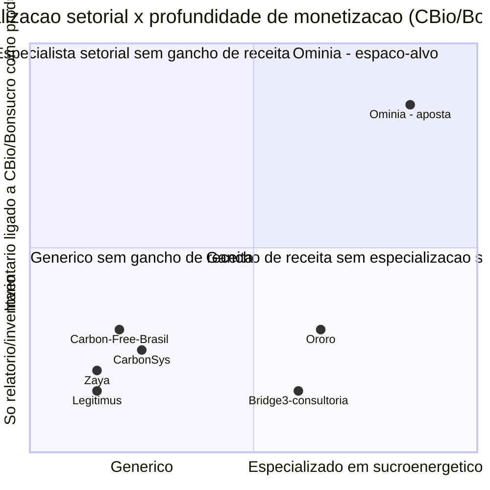

# Ominia — Tese de Negócio, Mercado e Modelo Comercial
## Foco: Inventário de Emissões de GEE para Agroindústria

Ebook interno de produto/negócio · Versão 0.2 (reescrita com foco único em inventário
de emissões) · 2026-08-24

> Esta versão substitui a v0.1, que tratava a Ominia como um hub de três pilares
> (Dados → Compliance → Valor). Decisão registrada nesta sessão: o hub completo é
> complexo demais para construir e vender como ponto de partida. Esta reescrita
> restringe o produto a **um único wedge**: inventário de emissões de GEE (Escopo 1,
> 2 e 3, metodologia GHG Protocol) com trilha de auditoria e evidência automática —
> o pedaço do Pilar 2 (Compliance) do PRD original com maior urgência real hoje. Os
> pilares Dados e Valor completos, e o restante do catálogo de frameworks (GRI, IFRS
> S1 amplo, questionários genéricos), saem do escopo de venda v1 e viram roadmap
> (capítulo 14). Números de mercado, regulação e concorrência foram repesquisados
> especificamente para este escopo mais estreito — não são um recorte da v0.1.

---

## 1. Sumário executivo

A Ominia vende **inventário de emissões de GEE auditável para agroindústria
brasileira, com um caminho claro até dinheiro** — não um relatório de sustentabilidade
genérico. A tese em uma frase: o inventário de emissões deixa de ser custo de
compliance e passa a ser **o que sustenta mais CBios emitidos, elegibilidade a
Bonsucro e prontidão para o mercado regulado de carbono (SBCE)** — três coisas que já
valem dinheiro ou já são exigidas por comprador, hoje, para uma usina de
cana-de-açúcar.

Quatro fatos de mercado sustentam essa versão mais estreita da tese, todos vindos de
pesquisa dedicada para esta reescrita (fontes no capítulo 16):

1. **O inventário de emissões já é o item mais concreto e mensurável dentro do
   universo "ESG"** — ao contrário de "compliance geral" ou "score ESG", ele tem uma
   metodologia internacional única (GHG Protocol), uma unidade de medida clara
   (tCO2e) e, no caso do setor sucroenergético, **um mecanismo que já converte
   inventário preciso em receita**: o RenovaBio/CBio.
2. **O CBio está em um momento que favorece quem tem inventário melhor, não pior.**
   O preço do CBio caiu de ~R$75 (início de 2025) para a faixa de R$29-32 em 2026 —
   queda de mais da metade — enquanto o volume negociado subiu 53% no mesmo
   comparativo. Ou seja: **a margem por CBio caiu, e o volume emitido corretamente
   passou a importar mais**, não menos, para compensar o preço mais baixo (capítulo
   4.2). Isso é um argumento comercial direto para uma ferramenta de inventário
   melhor, e é um dado que a v0.1 deste documento não tinha.
3. **O SBCE (mercado regulado de carbono brasileiro) ainda não confirmou o agro na
   primeira fase.** A primeira etapa (2027) cobre alumínio, aço, cimento, petróleo e
   gás, papel e celulose e aviação — **não** inclui explicitamente agroindústria ou
   alimentos/bebidas até a publicação oficial da lista final (capítulo 4.1). Isso é
   dito às claras: não dá para vender "você é obrigado pelo SBCE" para uma usina hoje.
   A venda é "prepare-se antes, e monetize o inventário via CBios/Bonsucro enquanto
   isso".
4. **O mercado de ferramentas de inventário de GEE no Brasil não está vazio** — ao
   contrário do quadrante "hub completo" da v0.1, que estava genuinamente livre, o
   segmento estreito de "software de inventário de emissões" já tem players
   brasileiros ativos (Ororo, CarbonSys, Zaya, Legitimus, Carbon Free Brasil — capítulo
   8). Isso muda a natureza da aposta: não é mais "ser o primeiro", é **"ser o mais
   profundo em sucroenergético e o único que liga inventário a CBio/Bonsucro como
   produto, não como funcionalidade lateral"**.

O ICP permanece o mesmo da v0.1 (usinas de cana-de-açúcar de porte médio-grande,
capítulo 5), mas o produto, o preço e a análise competitiva mudam integralmente.

---

## 2. A tese de negócio (redefinida)

### 2.1 O problema em uma frase

A usina sabe, aproximadamente, quanto emite — mas não tem esse número num formato que
resista a auditoria, que maximize CBios corretamente apurados, ou que responda rápido
a um comprador, banco ou certificadora (Bonsucro) pedindo evidência. O dado de energia,
combustível, insumo e resíduo existe em planilha, ERP e nota fiscal, mas ninguém junta
isso num inventário defensável de Escopo 1, 2 e 3 sem um processo manual, refeito a
cada pedido.

### 2.2 Por que inventário de emissões, especificamente, e não o hub inteiro

Comparado ao restante do universo ESG (score de fornecedor, políticas internas,
questionários genéricos), o inventário de emissões tem três vantagens como ponto de
entrada de produto:

- **Metodologia única e internacional** (GHG Protocol) — não é preciso decidir "qual
  norma priorizar primeiro" como no restante do Pilar Compliance; o padrão já existe
  e já é o que todo comprador/banco/certificadora pede.
- **Ligação direta e já existente com dinheiro**, via RenovaBio/CBio — nenhum outro
  dado ESG do setor sucroenergético tem um mercado secundário líquido comprando
  aquele número hoje (capítulo 4.2).
- **Escopo tecnicamente menor** — não exige as integrações de ERP multi-fonte do
  Pilar Dados completo nem o motor de score/ledger financeiro do Pilar Valor; é
  coleta estruturada + cálculo por fatores de emissão + evidência + trilha de
  auditoria. Constrói-se em semanas, não em uma arquitetura de hub.

### 2.3 Por que agroindústria, por que Brasil (mantido da v0.1, ainda válido)

O agronegócio é **25,13% do PIB brasileiro em 2025** (R$ 3,20 trilhões, alta de 12,2%
no ano) e as exportações do setor bateram recorde de **US$ 169,2 bilhões em 2025**
(48,5% de tudo que o Brasil exporta) — CEPEA/CNA; Ministério da Agricultura, 2026. Não
existe outro setor no Brasil onde "prova de emissão" tenha, ao mesmo tempo, tanto peso
econômico e tão pouca ferramenta especializada em sucroenergético especificamente
(capítulo 8). **Nota:** o PIB do agro não cresce em linha reta — CEPEA registrou recuo
de ~2% no 1º trimestre de 2026 após o forte 2025; tratar como tendência de médio
prazo.

### 2.4 A aposta central: inventário como produto que se paga, não como custo

O argumento de venda não é "você precisa de compliance" — é **"o inventário melhor se
paga sozinho via CBios mais precisos e elegibilidade a crédito verde, e o compliance
vem de graça junto"**. Isso inverte a lógica de venda por medo (que a v0.1 já havia
identificado como frágil, dado que a CVM reverteu a obrigatoriedade do CBPS em
maio/2026 — capítulo 4.4) para venda por retorno mensurável, o que é uma venda mais
fácil de fechar e mais defensável na renovação.

---

## 3. Oportunidade de mercado no Brasil

### 3.1 Tamanho do setor-alvo (agroindústria brasileira, sucroenergético)

| Métrica | Valor | Fonte |
|---|---|---|
| PIB do agronegócio (2025) | R$ 3,20 trilhões (25,13% do PIB nacional) | CEPEA/USP + CNA, 2026 |
| Exportações do agronegócio (2025) | US$ 169,2 bilhões (recorde; 48,5% das exportações totais do Brasil) | Ministério da Agricultura / Agência Gov, jan/2026 |
| Usinas de cana-de-açúcar em operação | ~260 unidades na safra 2024/25 (UNICA, base operacional) | UNICA, boletins de safra |
| **Usinas certificadas para emitir CBios (RenovaBio)** | **332 usinas** (das quais 4 também produzem biometano e 39 biodiesel) | ANP, 2026 |
| CBios escriturados por sucroenergéticas (acumulado até nov/2025) | 37,11 milhões de títulos | Novacana / consultoria setorial |
| Projeção de CBios emitidos em 2026 | 45,1 milhões de títulos (+4,7% vs. 2025) | Novacana |

**Por que a contagem de 332 usinas importa mais aqui do que a de "~260-400" da v0.1:**
para um produto de inventário de emissões vendido com o gancho de CBio, o número
relevante não é "quantas usinas existem", é **quantas já estão dentro do mecanismo que
monetiza o inventário** — e a ANP já certificou 332 para isso. É a base mais precisa e
mais qualificada de ICP que este documento já produziu.

### 3.2 O mercado de software de contabilidade de carbono — tamanho, e uma discrepância grande que precisa ser dita

| Segmento medido | Tamanho | Projeção | Fonte |
|---|---|---|---|
| Carbon management software (definição estreita, só SaaS) | US$ 744 milhões (2025) | US$ 1,8 bi até 2031 (~15% CAGR) | Verdantix |
| Carbon accounting market (definição ampla) | US$ 29,82 bilhões (2026) | US$ 97,58 bi até 2031 (~26,8% CAGR) | Mordor Intelligence |
| Carbon accounting software platforms (outra metodologia ampla) | US$ 13 bilhões (2026) | US$ 68 bi até 2033 (~22% CAGR) | Intel Market Research |
| Carbon accounting software (mais uma metodologia ampla) | US$ 27,78 bilhões (2026) | US$ 63,54 bi até 2030 (~23% CAGR) | The Business Research Company |

**Isto precisa ser dito às claras, no mesmo espírito de rigor da v0.1:** há uma
diferença de **quase 40x** entre a estimativa mais estreita (Verdantix, US$744
milhões) e as mais amplas (US$13-30 bilhões). Isso não é erro de uma fonte — é
diferença de escopo: as estimativas amplas de "carbon accounting market" muito
provavelmente somam software + consultoria + serviços de MRV (monitoramento,
relato, verificação) + tecnologia de captura/mercado de créditos, não apenas o
software de inventário que a Ominia constrói. **Para efeito de dimensionamento deste
produto, a referência correta é a Verdantix (US$744 milhões → US$1,8 bilhão, 2025-2031,
~15% CAGR)**, por medir especificamente "carbon management software" — o mesmo
escopo funcional do produto Ominia. As demais linhas ficam registradas por
transparência, não por serem usáveis em pitch.

> **O que não existe, de novo:** nenhuma quebra confiável em dólares ou reais
> especificamente para o Brasil dentro desse mercado. O caminho, como na v0.1,
> continua sendo construir de baixo para cima (capítulo 3.3).

### 3.3 TAM / SAM / SOM — recalculado para o produto de inventário de emissões

| Camada | Definição | Cálculo ilustrativo | Resultado (faixa) |
|---|---|---|---|
| **TAM** | Usinas certificadas RenovaBio + agroindústrias médias-grandes com pressão de exportação/crédito que precisam de inventário GEE | 332 usinas certificadas + ~500-1.000 agroindústrias médias-grandes adicionais × ticket médio anual de R$ 60k–130k (capítulo 7) | **R$ 65 milhões – R$ 175 milhões/ano** |
| **SAM** | Subconjunto alcançável via GTM direto + parceria com certificadoras/tradings, com porte suficiente para justificar o ticket | ~20-30% do TAM | **R$ 15 milhões – R$ 50 milhões/ano** |
| **SOM** | Captura realista em 3 anos, dado ciclo de venda B2B e concorrência local já instalada (capítulo 8) | ~3-8% do SAM em 3 anos | **R$ 500 mil – R$ 4 milhões/ano de receita recorrente** |

Este TAM é deliberadamente **menor** que o da v0.1 (R$600 milhões – R$1,4 bilhão) —
isso é esperado e correto: um wedge de produto mais estreito tem um mercado endereçável
menor, em troca de um ciclo de venda mais curto e uma construção mais rápida. Tratar
como ordem de grandeza, não previsão financeira.

### 3.4 A pressão comercial permanece mais forte que a obrigação doméstica

Herdado da v0.1 e ainda válido: crédito rural sustentável está mais concorrido (volume
caiu R$8,2 bilhões até março/2026), o que valoriza quem prova elegibilidade de forma
organizada — e essa prova depende, na base, do mesmo inventário de emissões que este
documento agora trata como produto principal, não como um módulo entre vários.

---

## 4. Os vetores regulatórios e comerciais específicos de emissões

### 4.1 SBCE — Sistema Brasileiro de Comércio de Emissões

| Item | Status real (ago/2026) |
|---|---|
| Base legal | Lei 15.042/2024 |
| Proposta de cronograma | Publicada pelo Ministério da Fazenda em 19/mai/2026, cobrindo 17 setores altamente emissivos, implantação entre 2027 e 2031 |
| **Fase 1 (relato obrigatório a partir de 2027)** | Alumínio primário, ferro e aço (usinas integradas), cimento, exploração e produção de petróleo e gás, refino de petróleo, papel e celulose, transporte aéreo |
| Transição metodológica | Cada setor tem 4 anos de "só relato", sem custo ou obrigação de redução real, antes de entrar no regime de limite (cap) |
| Operadores >10.000 tCO2e/ano | Precisam submeter plano de monitoramento entre 2028-2029 |
| Fase de transação plena / cap nacional | Prevista para 2030-2031 |
| **Agroindústria / alimentos e bebidas** | **Não confirmado na Fase 1.** Não há, até esta pesquisa, base oficial para afirmar se ou quando cadeias agroindustriais entram no SBCE — a lista final ainda não foi publicada. |

**Implicação de venda:** o SBCE **não é** hoje um argumento de "você é obrigado" para
uma usina de cana. É um argumento de **antecipação**: quem já tem inventário GHG
Protocol organizado entra em qualquer fase futura do SBCE sem retrabalho, e usa esse
inventário para CBios/Bonsucro enquanto isso (capítulo 4.2, 4.3). Vender o SBCE como
obrigação hoje seria repetir o erro que a v0.1 já identificou com CBPS/CVM 244.

### 4.2 RenovaBio / CBios — o mecanismo que já vale dinheiro, hoje

O RenovaBio (Lei 13.576/2017) é o único vetor regulatório deste documento que já
**converte inventário de emissões em receita líquida** para uma usina, sem depender de
nenhuma obrigação futura.

| Métrica | Valor | Leitura |
|---|---|---|
| Preço do CBio, início de 2025 | ~R$75 | Pico recente |
| Preço do CBio, dez/2025 | ~R$24,30 (mínima do ano) | Queda de ~68% no ano |
| Preço do CBio, fev/2026 | ~R$32 | Recuperação parcial |
| Preço do CBio, abr/2026 | ~R$29 | Ainda ~60% abaixo do início de 2025 |
| Volume negociado, abr/2026 | 7,54 milhões de créditos (+53% vs. abr/2025) | Volume sobe |
| Movimentação financeira, abr/2026 | R$219,45 milhões (−35,5% vs. abr/2025) | Receita cai apesar do volume subir — efeito preço domina |
| Usinas certificadas | 332 (ANP) | Base endereçável direta |

**Leitura para a tese de produto:** com o preço por CBio caindo mais rápido do que o
volume sobe, **a margem por tonelada evitada caiu** — o que significa que uma usina
precisa apurar e emitir CBios com mais precisão e menos perda (por erro de cálculo,
subestimação ou inventário incompleto) só para manter a receita que já tinha. Isso é
um argumento comercial concreto e datado, não um discurso genérico de "sustentabilidade
importa": **inventário melhor = menos CBio deixado na mesa**, num momento em que cada
CBio vale menos.

### 4.3 Bonsucro — o padrão setorial que já exige inventário

Bonsucro é a certificação internacional voluntária de cana-de-açúcar sustentável,
usada como critério de compra por parte relevante dos importadores globais de açúcar e
etanol. O padrão já exige métrica de GEE como parte da certificação — ou seja, é
**hoje**, não em 2027, um motivo direto para uma usina exportadora ter inventário
organizado. Junto com o RenovaBio, é o vetor de maior urgência real e imediata do
capítulo 4 inteiro (herdado da constatação já feita na v0.1, capítulo 3.4, mas agora
como pilar central da tese, não como nota lateral).

### 4.4 CBPS / IFRS S1-S2 — relevância específica para clima, e o alerta que continua valendo

A Resolução CVM 244 (29/mai/2026) reverteu a obrigatoriedade de divulgação
CBPS/IFRS S1-S2 que a Resolução CVM 193 (2023) havia criado — voltou a ser
**voluntária**, regime "pratique ou explique". O IFRS S2 é especificamente sobre
divulgação relacionada a clima, incluindo emissões — então continua relevante para o
produto de inventário, mas como diferencial comercial ("sair na frente"), não como
obrigação legal a vender hoje.

### 4.5 EUDR — tangencial, não é sobre emissões diretamente

O Regulamento Europeu de Desmatamento entra em vigor para operadores grandes/médios em
30/12/2026 e cobre soja, carne, café, cacau, madeira, dendê e borracha — **não cobre
cana-de-açúcar/etanol diretamente**. É rastreabilidade de origem, não inventário de
GEE. Fica registrado como vetor relevante para o ICP secundário (capítulo 5.2), não
para o produto de emissões do ICP primário.

---

## 5. Público-alvo e ICP

### 5.1 ICP primário

| Critério | Perfil-alvo |
|---|---|
| Setor | Sucroenergético — usinas certificadas RenovaBio (base de 332, capítulo 3.1) |
| Porte | Médio-grande, múltiplas unidades/plantas |
| Sinal de dor | Já emite CBios mas suspeita de estar deixando volume na mesa; já responde due diligence de comprador Bonsucro; já sentiu o preço do CBio cair (capítulo 4.2) |
| Gatilho comercial | Renovação de certificação Bonsucro, fechamento de safra (janela natural para revisar o inventário do ano), ou queda de receita de CBio identificada internamente |

### 5.2 ICP secundário / expansão futura

Mesma lógica multi-commodity da v0.1, mas priorizada agora pela urgência de **emissões
especificamente**, não de ESG amplo: soja e carne (maior volume de exportação,
pressão de compradores globais por pegada de carbono declarada), depois café.
Cana/etanol continua sendo o ponto de entrada porque é o único com mecanismo de
monetização direta (CBio) já maduro.

### 5.3 Personas compradoras

| Persona | O que essa persona quer ver |
|---|---|
| **Diretor(a) de Sustentabilidade/ESG** (quando existe) | Inventário pronto sem garimpar e-mail/planilha a cada renovação Bonsucro |
| **Diretor Financeiro / de Relações com Investidores** | Quanto CBio a mais (ou a menos) o inventário atual está gerando — número em R$, não em tCO2e |
| **Diretor Industrial** | Que o sistema não vire trabalho extra de coleta manual |

---

## 6. O produto: Inventário de Emissões Ominia

### 6.1 Escopo funcional (v1 — deliberadamente restrito)

- Inventário de GEE — **Escopo 1** (emissões diretas: queima de combustível,
  processos), **Escopo 2** (energia elétrica comprada) e **Escopo 3** (cadeia de
  fornecedores, transporte, insumos) — metodologia **GHG Protocol**.
- Coleta estruturada (upload de planilha/ERP para os dados que já existem — **não**
  inclui, nesta v1, a integração automática multi-ERP completa que o Pilar Dados da
  v0.1 previa; isso fica para depois, capítulo 14).
- Cálculo por fatores de emissão (fatores públicos reconhecidos — GHG Protocol,
  inventário nacional — aplicados de forma auditável, com a fonte do fator sempre
  visível).
- Trilha de auditoria — cada valor carrega origem, timestamp, quem validou.
- Pacote de evidências por indicador (herdado do PRD original, seção 3.2): para cada
  fonte de emissão, o sistema monta o conjunto de documentos que sustenta aquele
  número.

### 6.2 O que fica fora da v1, deliberadamente

- Score de fornecedor, políticas internas, questionários genéricos de terceiros,
  ledger financeiro amplo (economia de água/resíduo fora do escopo de emissões),
  cenários climáticos, matriz de risco ESG ampla. Tudo isso era Pilar Dados
  completo/Compliance completo/Valor na v0.1 — vira roadmap (capítulo 14), não
  promessa de venda v1.

### 6.3 O diferencial real: inventário ligado a dinheiro, não só a relatório

Nenhum concorrente mapeado (capítulo 8) entrega, como parte central do produto — não
como add-on —, a leitura de **"quantos CBios este inventário sustenta, e quanto isso
vale em R$ ao preço de mercado atual"**. Isso transforma o card de indicador do PRD
original:

```
Indicador:          Emissões evitadas (Escopo 1) — safra 2026
Status:             94% completo
CBios sustentados:  ~[N] títulos, ao preço médio do mês: R$[X]
Evidências:         [N] documentos
Fonte:              Combustível + energia + processo industrial
Última validação:   [data]
```

Esse card é o que separa a Ominia de "mais um software de inventário de GEE" —
transforma o número de emissão em número de receita, na mesma tela.

---

## 7. Modelo de negócio e precificação

> **Aviso de enquadramento, herdado da v0.1:** faixas propostas, ancoradas em
> benchmark — não preços testados em venda real.

### 7.1 Benchmarks de mercado

| Referência | Faixa | Nota |
|---|---|---|
| Normative (carbon accounting, global) | US$3k/ano (entrada) até ~US$200k/ano (topo) | Benchmark internacional mais próximo do escopo estreito da Ominia v1 |
| Watershed | US$37k – US$264k/ano | Enterprise, escopo mais amplo que só inventário |
| Persefoni | Comparável a Watershed/Normative no topo | Enterprise |
| SMB carbon accounting (mercado global, entrada) | a partir de US$299/mês (~US$3.6k/ano) | Piso do mercado internacional para ferramentas simples de inventário |
| **Concorrentes brasileiros (Ororo, CarbonSys, Zaya, Legitimus, Carbon Free Brasil)** | **Não divulgado publicamente** | Nenhum destes publica preço; validar por cotação direta antes de fixar tabela (capítulo 15) |

**Leitura:** o ICP da Ominia (usinas médias-grandes, multi-unidade, já dentro do
RenovaBio) está acima do piso SMB internacional, mas o produto v1 é mais estreito que
Watershed/Persefoni — a faixa correta de ancoragem é próxima da Normative de entrada a
meio de tabela, ajustada para cima pelo componente exclusivo de leitura de CBio
(capítulo 6.3), que nenhum benchmark internacional precifica porque é específico do
Brasil.

### 7.2 Os planos da Ominia (v1)

| Plano | Escopo | Unidades incluídas | Mensalidade (faixa) | Setup (único) |
|---|---|---|---|---|
| **Ominia Inventário — Essencial** | Escopo 1+2, 1 unidade | 1 | R$ 2.900 – 4.900 | R$ 8.000 – 15.000 |
| **Ominia Inventário — Sucroenergético** | Escopo 1+2+3, leitura de CBio/Bonsucro, multi-unidade | até 3 | R$ 6.900 – 12.900 | R$ 15.000 – 30.000 |
| **Ominia Inventário — Grupo** | Múltiplas usinas/grupo, integrações sob medida | 4+ | sob consulta (referência R$ 15.000 – 30.000+/mês) | sob escopo |

Unidade adicional além do limite do plano: **R$ 700 – 1.200/mês**.

### 7.3 Racional de precificação

- Ticket **abaixo** do "Ominia Dados" da v0.1 (R$5.900-9.900) porque o escopo de dado
  é mais estreito (só emissões, não as 7 fontes do Pilar Dados completo).
- Ticket do plano Sucroenergético se aproxima do antigo "Ominia Compliance" da v0.1
  porque agrega o mesmo ativo caro de replicar manualmente (evidência + trilha de
  auditoria), mas dentro de um escopo funcional menor — o preço reflete o **valor da
  leitura de CBio**, não o volume de dado processado.
- Desconto de 15% para pagamento anual antecipado, reajuste anual IPCA + até 5%
  (mantido da v0.1, ainda razoável).

### 7.4 ARPU e ciclo de venda projetados

ARPU mensal ilustrativo: **R$ 5.000 – 10.000/mês** (R$60k-120k/ano por cliente) — mix
majoritariamente no plano Sucroenergético dado o ICP. Ciclo de venda esperado **mais
curto** que o hub completo da v0.1 (2-4 meses, não 3-9) porque a decisão de compra é
mais simples (um produto, um problema, um retorno claro em CBio) e o comprador
frequentemente já orçou "algo para o inventário" mesmo que hoje seja planilha ou
consultoria pontual.

---

## 8. Análise competitiva / benchmark

### 8.1 Matriz de concorrentes (repesquisada especificamente para inventário de emissões)

| Concorrente | O que faz | Geografia | Sobreposição | Onde a Ominia é diferente |
|---|---|---|---|---|
| **Ororo** | Plataforma de ESG e inventário de carbono com experiência específica em grandes produtores rurais e agroindústrias | Brasil | **Alta** — é o concorrente brasileiro mais próximo do ICP e do escopo | Ororo é ESG amplo com módulo de GEE; a Ominia é **especializada em emissões + leitura de CBio/Bonsucro como produto central**, não como um módulo entre vários |
| **CarbonSys** (gestaodeemissoes.com.br) | Software dedicado a inventário de GEE, automação da elaboração do inventário por fontes de emissão | Brasil | **Alta** — concorrente direto de escopo | Não identificado foco setorial em sucroenergético/CBio; Ominia liga inventário a receita de CBio explicitamente |
| **Zaya** | Plataforma para completar inventário GEE "rápido e fácil" | Brasil | Média-alta | Posicionamento generalista (qualquer empresa), não agro-específico |
| **Legitimus Ambiental** | Ferramenta de cálculo de emissões para empresas de todos os portes | Brasil | Média | Generalista, sem especialização setorial aparente |
| **Carbon Free Brasil** | Metodologias internacionais (GHG Protocol, ISO 14064) + plataforma de gestão de dado de emissão | Brasil | Média-alta | Não identificado gancho de monetização (CBio/Bonsucro) como produto |
| **AFRY — App Carbon Meter** | App para facilitar inventário de emissões | Brasil (subsidiária de consultoria global) | Média | Ferramenta de apoio a serviço de consultoria, não SaaS autônomo focado no cliente final |
| **Bridge3** | Consultoria (não SaaS) especializada em GHG Protocol para agricultura | Brasil | Baixa-média — é serviço, não produto recorrente | Concorre pelo mesmo orçamento, mas como projeto pontual de consultoria, não assinatura — argumento de venda direto: plataforma substitui recontratação anual de consultoria |
| **Watershed / Persefoni / Normative** | Contabilidade de carbono enterprise, Escopo 1-3 | Global | Baixa para o ICP atual (ticket e foco não-Brasil) | Referência de preço/produto "classe mundial", não concorrente ativo no ICP sucroenergético hoje |
| **Agrotools** | Data lake geoespacial e risco de crédito rural/seguro; não é ferramenta de inventário de GEE dedicada | Brasil | Baixa direta neste escopo específico | Adjacente — parceiro potencial de dado geoespacial, não concorrente de inventário |

### 8.2 O que mudou frente à v0.1: o quadrante não está vazio

A v0.1 descrevia o quadrante "hub completo + alta especialização agro-BR" como vazio.
**Isso não é verdade para o quadrante mais estreito "inventário de emissões +
especialização agro-BR"** — Ororo, CarbonSys, Zaya, Legitimus e Carbon Free Brasil já
disputam esse espaço, com a Ororo like a mais próxima em especialização setorial.
Reconhecer isso é o ponto mais importante desta reescrita: **a aposta da Ominia não
pode mais ser "somos os únicos"**, tem que ser **"somos os únicos que ligam o
inventário a CBio/Bonsucro como produto central, dentro do setor sucroenergético
especificamente"**.



O quadrante superior direito (alta especialização sucroenergética + inventário
explicitamente ligado a CBio/Bonsucro) está livre — nenhum concorrente mapeado faz as
duas coisas ao mesmo tempo. Esse é o espaço real da aposta, mais estreito e mais
defensável do que "hub ESG completo" da v0.1.

### 8.3 Sinal de janela de tempo

Sem evento de consolidação específico identificado nesta pesquisa (diferente da v0.1,
que citou a aquisição Persefoni-Diligent). Isso é, em si, informação: o segmento
brasileiro de inventário de GEE ainda está fragmentado entre pequenos players locais
— **é uma janela aberta, mas sem prazo de urgência externo forçando velocidade**; a
pressão de tempo real vem do calendário de safra e renovação Bonsucro do próprio
cliente, não de M&A do setor.

---

## 9. Estratégia de go-to-market

### 9.1 Motion de vendas

Ciclo mais curto que a v0.1 (2-4 meses, capítulo 7.4). **Piloto pago de 60 dias**
(mais curto que os 90 dias da v0.1, porque o escopo é menor) cobrindo uma safra
parcial ou uma unidade, com entrega do primeiro inventário completo e a leitura de
CBio associada como prova de conceito.

### 9.2 Canais

- **Direto** — prospecção em usinas certificadas RenovaBio (lista pública da ANP é o
  ponto de partida mais preciso que existe para esta venda — capítulo 3.1).
- **Via Bonsucro / certificadoras** — parceria de indicação: quem já está no ciclo de
  auditoria Bonsucro é o comprador mais qualificado que existe.
- **Via consultorias de GHG Protocol** (ex.: perfil Bridge3) — não como concorrente a
  evitar, mas como canal: consultorias que hoje fazem o inventário manualmente uma vez
  por ano podem recomendar a Ominia como a ferramenta que sustenta o trabalho delas
  entre um projeto e outro.

### 9.3 Conteúdo e autoridade

Um boletim trimestral específico sobre preço/volume de CBio + o que isso significa
para a apuração de inventário (capítulo 4.2) é um ativo de marketing barato e
diretamente ligado ao produto — mais afiado do que o boletim regulatório amplo da
v0.1, porque fala a língua financeira do CFO/diretor de RI da usina, não só a língua
de compliance.

---

## 10. Processos e metodologia

### 10.1 Metodologia de entrega

(1) Mapeamento das fontes de emissão da unidade (combustível, energia comprada,
principais insumos de Escopo 3) — 1-2 semanas; (2) aplicação dos fatores de emissão
GHG Protocol e primeira apuração — 1-2 semanas; (3) validação e evidência documental —
1-2 semanas. Meta: primeiro inventário "completo" em até **45 dias** de contrato
(mais rápido que os 60 dias da v0.1, escopo menor).

### 10.2 Processo de atualização de fatores de emissão

Os fatores de emissão (GHG Protocol, inventário nacional) mudam de versão
periodicamente — mesma lógica da v0.1 (framework como configuração, não retrabalho):
um processo interno de monitoramento mantém a tabela de fatores atualizada como dado,
nunca como mudança de arquitetura.

---

## 11. Time e estrutura organizacional (MVP enxuto)

| Função | Por que é crítica na v1 |
|---|---|
| **Especialista em GHG Protocol / inventário de emissões** (não "especialista ESG amplo") | Mantém a metodologia e os fatores de emissão corretos — ativo que justifica o preço acima do piso SMB |
| **Engenheiro(a) full-stack (produto)** | Constrói e mantém a plataforma — escopo bem menor que o hub completo, um único fluxo de dado |
| **Customer Success / Implementação com conhecimento de sucroenergético** | Onboarding em 45 dias (capítulo 10.1) |
| **Vendas com relacionamento no setor sucroenergético** | Ciclo mais curto (capítulo 9.1), mas ainda B2B relacional |

Headcount de lançamento (Fase 1, 0-6 meses): **3-4 pessoas** — bem menor que as 4-6 da
v0.1, porque o produto é bem menor.

---

## 12. Previsão de custos e unit economics (recalculado)

> Mesmo aviso da v0.1: faixas ilustrativas de mercado, não pesquisa salarial dedicada.

| Fase | Headcount | Folha mensal estimada | Infra/ferramentas | Burn mensal total |
|---|---|---|---|---|
| Fase 1 — MVP (0-6m) | 3-4 | R$ 55.000 – 90.000 | R$ 5.000 – 10.000 | R$ 60.000 – 100.000 |
| Fase 2 — Tração (6-12m) | 5-7 | R$ 100.000 – 160.000 | R$ 10.000 – 18.000 | R$ 110.000 – 180.000 |

Com ARPU mensal projetado de R$5k-10k (capítulo 7.4), o breakeven da Fase 2 exige
aproximadamente **11 a 36 clientes ativos** — mais clientes que o hub completo da v0.1
para o mesmo breakeven em R$, porque o ticket é menor; compensado por ciclo de venda
mais curto e CAC menor por negócio mais simples de explicar.

---

## 13. Riscos de negócio e mitigação

| Risco | Mitigação |
|---|---|
| Mercado de inventário de GEE no Brasil não está vazio (capítulo 8.2) — Ororo em particular já tem tração declarada em agro | Diferenciação explícita via leitura de CBio/Bonsucro como produto central, não só inventário — validar com 3-5 clientes-piloto se esse gancho realmente muda a decisão de compra |
| SBCE não confirma agro na Fase 1 — argumento regulatório de urgência é fraco | Vender por retorno de CBio (capítulo 4.2), não por obrigação futura incerta |
| Preço do CBio pode se recuperar ou cair ainda mais, mudando a força do argumento comercial | Monitorar trimestralmente (capítulo 9.3) e ajustar o discurso comercial ao cenário real, não a uma projeção fixa |
| Escopo v1 deliberadamente pequeno pode não sustentar ticket suficiente para o breakeven do capítulo 12 | Land-and-expand para o roadmap do capítulo 14 assim que o cliente-piloto validar o inventário — não é promessa de venda v1, mas é caminho de expansão de receita por cliente já existente |
| Nenhum preço de concorrente brasileiro (Ororo, CarbonSys etc.) é público | Cotação direta como parte da validação de preço do capítulo 15, antes de fixar tabela |

---

## 14. Roadmap além do MVP (não é promessa de venda v1)

A arquitetura de dados original (PRD, [DATA-MODEL.md](DATA-MODEL.md),
[DATA-MODEL-COMPLIANCE.md](DATA-MODEL-COMPLIANCE.md),
[DATA-MODEL-VALOR.md](DATA-MODEL-VALOR.md)) continua válida como visão de longo prazo
— o inventário de emissões é o **primeiro requisito completo** dentro do Pilar
Compliance, não uma ruptura de arquitetura. Expansão natural, nesta ordem, só depois
de 3-5 clientes validando o produto de inventário:

1. Ampliar o Pilar Dados para as demais 6 fontes (energia/água/resíduo além de
   emissão, fornecedores, indicadores sociais) — quando o cliente pedir.
2. Ampliar o catálogo de frameworks do Pilar Compliance (GRI, IFRS S1 amplo,
   questionários de terceiros) além do inventário de GEE.
3. Pilar Valor completo (ledger financeiro, elegibilidade de crédito verde além do
   CBio, score de fornecedor) — só depois que Compliance estiver maduro em clientes
   reais.

---

## 15. Próximos passos

1. Validar as faixas de precificação (capítulo 7.2) com 3-5 conversas reais de
   pré-venda com usinas certificadas RenovaBio (lista ANP, capítulo 3.1).
2. Cotar diretamente Ororo, CarbonSys, Zaya, Legitimus e Carbon Free Brasil (capítulo
   8.1) — nenhum publica preço; é a lacuna de dado mais importante deste documento.
3. Confirmar, na publicação oficial do Ministério da Fazenda, se e quando
   agroindústria/alimentos e bebidas entram na lista final de setores do SBCE
   (capítulo 4.1) — monitorar, não assumir.
4. Definir o piloto pago de 60 dias (capítulo 9.1) como motion comercial formal para
   os primeiros 3-5 clientes, com uma usina-âncora certificada RenovaBio.
5. Validar com um especialista em GHG Protocol (não só pesquisa de IA) a lista de
   fatores de emissão a usar no MVP antes de calcular o primeiro inventário real de
   cliente.

---

## 16. Fontes

- CEPEA/USP e CNA Brasil — PIB do agronegócio 2025/2026 (cepea.org.br, cnabrasil.org.br)
- Ministério da Agricultura / Agência Gov — exportações do agronegócio 2025
- UNICA — boletins de safra 2024/25 (unica.com.br)
- ANP — usinas certificadas RenovaBio, 2026
- Novacana, BiodieselBR, RPAnews, JornalCana — preço e volume de CBios, 2025-2026
- Ministério da Fazenda — proposta de cronograma setorial do SBCE, maio/2026
  (gov.br/fazenda)
- Agência Brasil, Poder360, Mattos Filho, ClimaInfo, Canal Rural, eixos — cobertura do
  cronograma SBCE
- CVM (gov.br) — Resolução 193/2023, Resolução 244/2026
- Verdantix — carbon management software, tamanho e projeção 2025-2031
- Mordor Intelligence, Intel Market Research, The Business Research Company — carbon
  accounting market (definição ampla, tratado com ressalva no capítulo 3.2)
- Ororo (ororo.com.br) — plataforma ESG/GEE para agronegócio
- CarbonSys / gestaodeemissoes.com.br — software de inventário GEE
- Zaya (zaya.eco) — plataforma de inventário GEE
- Legitimus Ambiental (legitimusambiental.com.br) — software GEE
- Carbon Free Brasil (carbonfreebrasil.com) — gestão de emissões
- AFRY — App Carbon Meter
- Bridge3 (bridge3.com.br) — consultoria GHG Protocol para agricultura
- Persefoni, Normative — benchmark internacional de carbon accounting software e preço

*(Pesquisa desta reescrita realizada em 2026-08-24 via busca dedicada, especificamente
para o escopo de inventário de emissões — não é um recorte da pesquisa da v0.1. Onde
uma fonte não pôde ser confirmada de forma independente ou apresenta discrepância
grande entre fontes, isso está sinalizado no corpo do texto — ver capítulos 3.2, 4.1 e
7.1 em particular antes de reusar qualquer número em material externo.)*
